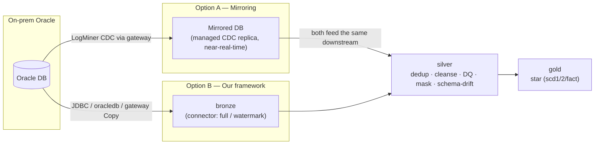

# Bronze ingestion: our framework vs Fabric Mirroring

**Question.** For a source like **on-premises Oracle**, should we ingest with our control-plane
connector (Oracle → **bronze** → **silver** → gold), or **mirror** the database into OneLake and
treat the mirror as bronze? This memo compares the two, with pros/cons and a recommendation for
BC Pension Corporation.

> **TL;DR** — They aren't really "either/or for the whole pipeline": **Mirroring replaces the
> *bronze acquisition* step only** — you still build silver/gold on top. Use **our framework as the
> default** for BCPC (governance, masking, subsetting, DQ, promotion, and no invasive changes to the
> source). Reach for **Mirroring on specific tables** when near-real-time latency is a genuine
> requirement *and* the table is cleanly relational *and* the Oracle DBA can enable CDC — then feed
> the mirror into our existing silver/gold. Mirroring for Oracle is still **Preview**.

---

## 1. What each approach actually is

- **Mirroring** — a Fabric-managed service that continuously replicates the source database into
  OneLake as Delta, near-real-time, with **no ETL you write**. For Oracle it uses **LogMiner-based
  CDC** through the **on-premises data gateway**. The result is a **raw 1:1 replica** of the source
  tables, always fresh.
- **Our framework** — config-as-code **batch ELT**. A connector lands the table into **bronze**
  (raw + control columns; full load or watermark-incremental), then **silver** deduplicates,
  cleanses, runs DQ + quarantine, masks, and tracks schema drift, and **gold** builds the star.
  Everything is declared in `config_db` and promoted DEV → UAT → PROD.

**The key reframe:** a mirror gives you a live **bronze**. It does **not** give you silver/gold —
you still model, cleanse, and govern on top. So the real comparison is *how raw data reaches
bronze*, after which the two converge.

---

## 2. Side-by-side

| Dimension | **Mirroring** (mirror = bronze) | **Our framework** (connector → bronze) |
|---|---|---|
| **Latency** | **Near-real-time** (CDC, continuous) | **Batch** (scheduled / event-triggered) |
| **You write ETL?** | No — fully managed replica | Yes — but it's config, not code (add a source = rows) |
| **Transformation at ingest** | **None** — raw 1:1 copy | Full — `filters`/`select` (subset rows & columns), typing, rename |
| **Data quality / cleansing** | Not built in (do it downstream) | **First-class** — `dq_rule`, `cleanse_rule`, quarantine on silver |
| **Sensitive-data control** | **Everything lands raw** in OneLake (all rows/columns, unmasked) | Mask/exclude **at ingest** — sensitive columns need never land raw |
| **Source prerequisites** | **Invasive**: ARCHIVELOG, LogMiner, supplemental logging (DB + per-table), CDC grants (`LOGMINING`, `FLASHBACK ANY TABLE`, …) | **Minimal**: a read account with `SELECT` |
| **Schema / type coverage** | Relational scalars only; **no LOBs / XML / complex types**; column DDL add/drop/rename only (no type changes) | Any type (complex columns pruned/handled); schema-drift **detected + logged** |
| **Table constraints** | Needs a **PK or unique index**; table name < 30 chars; ≤ 1000 tables | None — loads any table; keys are config, not a requirement |
| **History (SCD)** | Mirror = current state of source | Silver keeps latest; **gold does SCD1/SCD2/fact** |
| **Source coverage** | Per-source connector (Oracle, SQL Server, Snowflake, PostgreSQL, Cosmos… + Open Mirroring) | **Any** — jdbc / oracle / db2 / odbc / **HTTP-API** / files / on-prem-staged, one registry |
| **Promotion (DEV→UAT→PROD)** | Git/pipelines track the mirror *item* only; connection, **manual start**, **re-seed**, and views are per-env manual (see §4) | **Whole medallion is config-as-code** — sources+DQ+gold+security promote together; connection = a KV secret per env |
| **Ops model** | Microsoft-managed pipeline; **dedicated gateway VM**, archive-log retention, reseed memory spikes | You operate it; retries, capacity, and DQ are yours to tune |
| **Maturity** | Oracle mirroring is **Preview** | In production here today |
| **Cost** | Mirrored replica storage has a free allowance (capacity-based); low compute | Spark compute per run + storage |

---

## 3. Pros & cons

### Mirroring
**Pros**
- **Near-real-time** with essentially no engineering — the strongest reason to choose it.
- No ETL to build or maintain for the raw copy; Microsoft owns the CDC pipeline.
- Low, predictable cost for the replica; instantly queryable in OneLake / SQL endpoint / Direct Lake.
- Great for *operational reporting* on clean relational tables that need freshness.

**Cons**
- **Invasive on the source** — the Oracle DBA must enable ARCHIVELOG, LogMiner, and supplemental
  logging and grant CDC privileges. In a locked-down pension estate this is a real approval hurdle.
- **Raw, everything-lands** — no row/column subsetting or masking at ingest; **all data, including
  sensitive member/employer columns, is replicated into OneLake**. Governance must be enforced
  entirely downstream, and the raw copy still exists.
- **Coverage gaps** — no LOB/XML/complex types, no type-change DDL, tables must have a PK/unique
  index, ≤ 1000 tables, name-length limits. Any table that misses these simply won't mirror.
- **Still Preview** for Oracle — not yet a fit for a production system of record.
- You still build **silver/gold** — mirroring is not a substitute for the modelling layer.
- Ops caveats: dedicated gateway VM, archive-log retention (~24h), memory spikes on large reseeds.

### Our framework
**Pros**
- **Governance-first** — subset (`filters`/`select`), **mask or drop sensitive columns before they
  land**, DQ + quarantine, schema-drift detection, and code-driven security (CLS/RLS/DDM). For a
  pension org handling PII, keeping sensitive data out of raw OneLake is a material advantage.
- **No source changes** — only a `SELECT` account; nothing to enable on the Oracle side.
- **Universal** — the same registry ingests Oracle, SQL Server, APIs, files (dropbox), and
  gateway-staged on-prem, so one pattern covers the whole estate, not just mirror-eligible DBs.
- **Config-as-code + promotion** — declared once, promoted across environments, lineage in config.
- **Full modelling control** — typing, SCD history, the gold star, all owned by us.

**Cons**
- **Batch, not real-time** — freshness is the scheduled/triggered cadence, not seconds.
- **We own the pipeline** — retries, capacity tuning, and DQ authoring are our responsibility.
- Incremental extraction needs a watermark column (or a full reload) — CDC-grade change capture is
  not automatic the way LogMiner is.

---

## 4. Promotion across environments (DEV → UAT → PROD)

This is where the two diverge most for a governed shop — the user explicitly asked, so it's worth
its own section.

**Our framework — one config-as-code unit.** The *entire* medallion — sources, subset/`select`
rules, `cleanse_rule`, `dq_rule`, the gold `model`/`gold_object`, and `security_policy` — lives in
`config_db` and promotes as YAML (`cp_config`) alongside the bundled engine, which deploys
**identically** to every environment. Connections resolve from a Key Vault `secret_name` (one secret
per env), so pointing DEV / UAT / PROD at their own Oracle is a per-env *secret*, not a code change.
Promotion is `git → cp_bootstrap/cp_config` per environment: **ingestion, transformation, DQ, gold,
and security move together**, versioned and diffable, with no portal clicks.

**Mirroring — the replica config promotes; the rest is per-env manual.** Mirrored databases *do*
support Git integration and deployment pipelines now — but with real seams that add up per stage:

- **Only the mirror item is tracked in Git** (`mirroring.json` = the table selection). The
  **connection, credentials, gateway, SQL analytics endpoint, and any views are *not* tracked**.
- Deploying to a stage needs a **deployment rule** to rebind the mirror to *that* environment's
  **source connection ID** — so you first create the env's gateway connection, then wire the rule.
- The mirror **isn't started after deployment** — you start it manually (or via API) in each env,
  which triggers a **full re-seed** (fresh initial copy) from that environment's source.
- The **source-side CDC prerequisites** (ARCHIVELOG, LogMiner, supplemental logging, grants) must be
  enabled by the DBA on **each** environment's Oracle — that isn't deployable at all.
- **Downstream objects aren't promoted with the mirror** — SQL-endpoint views (and of course your
  silver/gold and security) are a separate ALM track.

**Net:** mirroring's CI/CD moves *which tables to replicate*, but per environment you still create a
connection, add a deployment rule, get the DBA to enable CDC on that Oracle, **start** the mirror,
and wait out a **re-seed** — then promote your silver/gold/security **separately**. The framework
promotes the whole pipeline, raw acquisition through governed gold, as a **single** config-as-code
artifact. For a three-environment pension estate, that difference is the gap between one repeatable
`cp_config` run and a portal-plus-DBA checklist repeated in each workspace.

---

## 5. When to choose which

**Lean Mirroring when** *all* hold: the table needs **near-real-time** freshness; it's **cleanly
relational** (PK/unique index, supported types, no LOBs); the DBA **can and will enable CDC**; and
**little/no transformation or masking is required at bronze**. Typical fit: a handful of
high-value operational tables for live dashboards.

**Lean our framework when** any hold: you must **subset, type, mask, or DQ-gate at ingest**
(sensitive data); the source **can't take CDC changes** or is a non-mirrorable type/shape; you need
**one pattern across heterogeneous sources** (Oracle + APIs + files); **batch latency is acceptable**
(most pension analytics); or you want **config-as-code promotion and lineage**.

---

## 6. Recommendation for BCPC

**Default to the framework** for on-prem Oracle → bronze → silver → gold. The deciding factors for a
pension corporation:

1. **Sensitive data stays controlled.** The framework can mask or exclude PII **before it lands**;
   mirroring replicates the raw source — including sensitive columns — into OneLake, shifting all
   protection downstream and leaving a raw copy behind.
2. **No invasive source changes.** We need only a read account; mirroring needs ARCHIVELOG +
   LogMiner + supplemental logging + CDC grants — a significant ask against a production Oracle
   system of record.
3. **One pattern for the whole estate.** The same control plane already ingests Oracle, APIs, and
   files; mirroring only covers mirror-eligible databases and would run alongside, not replace it.
4. **Maturity.** Oracle mirroring is **Preview**; the framework is in production here now.
5. **Latency is usually fine.** Pension reporting rarely needs sub-minute freshness; scheduled or
   event-triggered batch meets the need.
6. **Simpler promotion (§4).** The whole medallion promotes as one config-as-code unit; mirroring
   promotes only the replica config and leaves per-env connections, DBA CDC enablement, manual
   start, and re-seed as a checklist repeated in each workspace.

**But adopt Mirroring selectively, as a hybrid**, once it's GA and where it clearly wins: for a
**small set of clean, high-value tables that genuinely need near-real-time**, mirror them as bronze
and **feed the mirror straight into our existing silver/gold** (dedup, DQ, masking, star). That
captures mirroring's freshness while keeping our governance and modelling. It's additive — the
`staged`/on-prem connector already reads a landed Delta table, so a mirrored table drops into the
same silver/gold with no new engine work.

**Net:** framework by default for control and governance; mirroring as a targeted, hybrid
accelerator for the few tables where near-real-time is worth its prerequisites — never as a
replacement for the silver/gold layer.

---

*Sources:* [Mirror Oracle databases in Fabric](https://learn.microsoft.com/en-us/fabric/mirroring/oracle) ·
[Oracle mirroring limitations](https://learn.microsoft.com/en-us/fabric/mirroring/oracle-limitations) ·
[CI/CD for mirrored databases](https://learn.microsoft.com/en-us/fabric/mirroring/mirrored-database-cicd) ·
[Mirroring for Oracle (Preview) announcement](https://blog.fabric.microsoft.com/en-GB/blog/mirroring-for-oracle-in-microsoft-fabric-preview/) ·
[Open Mirroring partner ecosystem](https://learn.microsoft.com/en-us/fabric/mirroring/open-mirroring-partners-ecosystem).
Oracle mirroring is Preview as of this writing; verify limits before committing.
