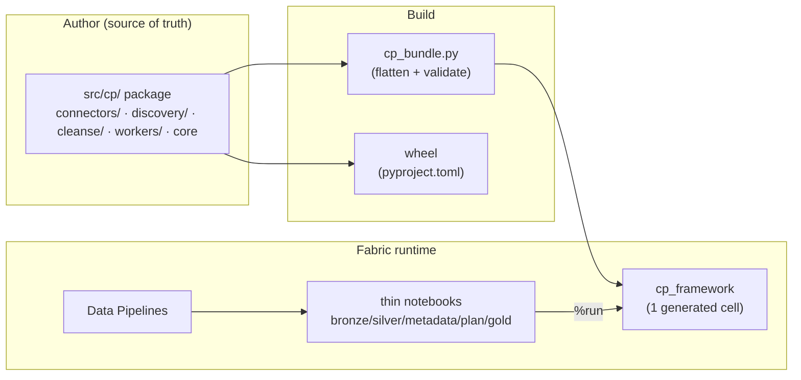

# Control Plane — Engine Design

How the Fabric control-plane **engine** is structured, why it's a modular package instead of one
big notebook, and how you extend it. For *using* the control plane (config tables, connectors,
DQ, promotion) see [`WORKING_GUIDE.md`](WORKING_GUIDE.md); for governance see
[`GOVERNANCE_SECURITY.md`](GOVERNANCE_SECURITY.md).

---

## 1. The idea in one paragraph

All runtime logic lives in a **modular Python package** (`control_plane/src/cp/`) — one concern
per module, **one file per connector**. The pipeline-called notebooks are **dumb 3-cell shells**
(parameters → import → one function call); they hold no logic, so they never change when the
engine changes. For the Fabric runtime, a **bundler** flattens the package into the single
`cp_framework` notebook that workers `%run` (zero session-startup cost, no Environment needed).
The *same* package also builds a **wheel**. Adding a source is dropping one file in
`cp/connectors/` — you never open the framework.



---

## 2. Repository layout

```
control_plane/
  src/cp/                      # THE ENGINE (source of truth; edit here)
    __init__.py                #   minimal — keeps pure modules importable off-cluster
    runtime.py                 #   spark, notebookutils, cp_vars, lakehouse GUIDs, WS id, config-DB id, tpath
    naming.py                  #   snake, _norm_ident, now_ts, landed_table          (pure — unit-tested)
    dag.py                     #   topo_levels                                        (pure — unit-tested)
    storage.py                 #   delta_exists, read/write_path, read_config, files_put
    secrets.py                 #   get_secret (Key Vault)
    config_db.py               #   config_conn/query/exec/exec_many (pyodbc + AAD)
    transform.py               #   business_cols, row_hash, merge_upsert
    audit.py                   #   run/object logging, watermarks, seed_control_tables, SCHEMAS
    gold/                      #   GOLD TABLE OPERATOR — one strategy file per type — auto-registered
      __init__.py              #     registry + @gold_strategy + gold_merge(stage,type,table,keys,run_id)
      scd1.py  scd2.py  fact.py
    connectors/                #   ONE FILE PER SOURCE — auto-registered
      __init__.py  base.py     #     registry + @ingest_connector + resolve/run_connector; shared helpers
      jdbc.py odbc.py http.py oracle.py db2.py staged.py entra.py file.py
    discovery/                 #   ONE FILE PER DISCOVERER — auto-registered
      __init__.py  sqlserver.py  statcan.py
    cleanse/                   #   cleanse function library — auto-registered
      __init__.py  functions.py
    workers/                   #   entrypoints called by the thin notebooks
      __init__.py  plan.py  bronze.py  silver.py  metadata.py  gold.py  dropbox.py
  notebooks/
    cp_framework.py            # GENERATED by cp_bundle.py — do not edit
    bronze_worker/silver_worker/metadata_worker/cp_plan/gold_runner/dropbox_worker.py  # 3-cell shells
    sq_*.py                    # gold source-query notebooks (per gold object; use gold_write)
  deploy/
    cp_bundle.py               # package -> cp_framework cell (validates public API + registries)
    cp_folders.py              # workspace folder placement (notebook/ +utility/sourcequery, pipeline/)
    cp_deploy.py cp_config.py cp_sqldb.py cp_security.py ...   # deploy tooling (already modular)
  tests/                       # off-cluster pytest (pure modules + bundle validity)
  pyproject.toml               # builds the wheel (package `cp`)
```

**Lakehouses** (resolved by name from `cp_vars`): `LH_metadata` (control/audit/ledger), `LH_bronze`,
`LH_silver`, `LH_gold` (medallion), and `LH_Filedrop` (dropbox landing — see §8).

**Dependency direction** (no cycles): `runtime → naming/dag → storage/secrets/config_db →
transform/audit → cleanse/connectors/discovery → gold → workers`.

**Built-in connectors:** `jdbc` (sqlserver/postgresql/mysql), `oracle`, `db2`, `odbc`, `http`
(any REST/CSV/zip-CSV API), `staged` (on-prem via gateway), **`entra`** (Microsoft Graph —
client-credentials, paginated directory objects), **`file`** (dropbox csv/txt/xlsx/xls).

---

## 3. Extending the engine — the whole point

### Add a source connector (zero framework edits)
Drop `src/cp/connectors/<name>.py`:

```python
from . import ingest_connector
from .base import _resolve_conn, _opts

@ingest_connector("salesforce")            # one or more names/aliases
def salesforce(o, user, password):
    c, opts = _resolve_conn(o), _opts(o)   # KV connection + per-object options
    ...                                    # fetch
    return spark.createDataFrame(pdf)      # MUST return a Spark DataFrame
```
Then set `datasource.connector = "salesforce"`. The folder auto-scan (`connectors/__init__.py`)
imports every module, so the decorator registers it — **you never touch a registry list or the
framework**. Rebuild the bundle (`python deploy/cp_bundle.py`) or just redeploy.

### Add a discoverer
`src/cp/discovery/<name>.py` with `@discoverer("connector_name")` returning candidate object
dicts. Same auto-scan.

### Add a cleanse function
`src/cp/cleanse/<something>.py` (or extend `functions.py`) with `@cleanse_fn("name")`. Reference
it from a `cleanse_rule` row.

**Contract summary**

| Extension | File | Decorator | Signature |
|---|---|---|---|
| Connector | `connectors/*.py` | `@ingest_connector("name", …)` | `(o, user, password) -> DataFrame` |
| Discoverer | `discovery/*.py` | `@discoverer("connector")` | `(datasource) -> [candidate dicts]` |
| Cleanse fn | `cleanse/*.py` | `@cleanse_fn("name")` | `(df, cols, params) -> df` |
| Gold strategy | `gold/*.py` | `@gold_strategy("type")` | `(gold_path, stage_df, keys) -> None` |

---

## 4. Thin worker notebooks

Every pipeline-called notebook is exactly three cells and holds **no logic** — so it is identical
under the `%run` bundle today and a wheel tomorrow:

```python
# PARAMETERS                      # cell 1 — pipeline injects these (tagged `parameters`)
run_id = "manual"; object_json = "{}"; src_user = ""; src_password = ""

# COMMAND ----------              # cell 2 — import the engine
%run cp_framework                 #   (wheel era: from cp import workers)

# COMMAND ----------              # cell 3 — one flexible call does the work
workers.bronze(run_id=run_id, object_json=object_json, src_user=src_user, src_password=src_password)
```

The `workers` namespace is provided identically in both eras: the bundle binds
`workers = SimpleNamespace(plan, bronze, silver, metadata, gold, dropbox)`; the wheel exposes the
same via `cp/workers/__init__.py`. Entrypoints take keyword args with defaults and `**kw`, so the
pipeline can pass any subset (e.g. `load_group` as a string is coerced with `int(...)`).

| Notebook | Entrypoint | Does |
|---|---|---|
| `cp_plan` | `workers.plan(load_group, plan_type)` | reads config_db, `notebookutils.notebook.exit(work_list)` |
| `metadata_worker` | `workers.metadata(run_id, load_group, …)` | discover objects (is_active=0) + column-drift snapshot |
| `bronze_worker` | `workers.bronze(run_id, object_json, …)` | one object: connector → select → control cols → bronze |
| `silver_worker` | `workers.silver(run_id, object_json)` | dedupe by key, cleanse, DQ+quarantine, upsert |
| `gold_runner` | `workers.gold(run_id, model_id)` | per gold object (topo order): run its SQ notebook → read the stage → apply the type's strategy |
| `dropbox_worker` | `workers.dropbox(run_id, file_path)` | register + load ONE dropped file (or scan all of `newfile/`) — see §8 |

**Gold build — stage then strategy.** A model's gold tables build in dependency order. For each
`gold_object`, the runner runs its **source-query notebook** — a *framework-free* SparkSQL/PySpark
transform that reads silver and writes a **stage** table (`CREATE OR REPLACE TABLE stage.<t> AS
SELECT …`) — then reads that stage and applies the **strategy** for the object's `gold_type`
(scd1/scd2/fact) to merge it into gold. The merge lives in `cp/gold/`, never in the notebook, so
SQ notebooks stay pure transforms. Deploy attaches `LH_silver`+`LH_gold` to the SQ notebooks (and
to `gold_runner`, since `notebook.run` executes the child in the parent's lakehouse context); the
silver name is injected from `cp_vars`, so it's rename-safe.

---

## 5. The bundler (`cp_bundle.py`)

Fabric's `%run` shares a flat namespace — it is not Python package import. The bundler bridges the
clean package to that runtime:

1. Concatenates modules in dependency order (`runtime` first; folders globbed so new files are
   auto-included).
2. **Strips intra-package imports** (`from .x import y`) — everything is one namespace in the cell
   — and drops `# --8<-- strip` blocks (the `pkgutil` folder auto-scan, which only applies to the
   real package).
3. Appends the `workers` namespace binding and `print("cp_framework loaded")`.
4. **Validates**: `ast.parse` the result, assert every name in `EXPECTED_PUBLIC` is defined and
   every expected connector/cleanse registry key appears — so a bundling mistake fails the build,
   never the pipeline.

`cp_deploy.py deploy` regenerates `cp_framework.py` from the package first (and the `tests/`
assert the committed file equals a fresh bundle, so it can't drift).

**Why not just use a wheel + Fabric Environment?** A wheel gives real `import cp`, but a Fabric
Environment adds session-startup latency to every notebook and must be republished on each change.
The bundler keeps the zero-setup `%run` runtime while we still author a real package — and it emits
the wheel too (`python -m build`), so the Environment route is available later with no rework.

---

## 6. Runtime dependency model

`runtime.py` resolves `spark` via `SparkSession.builder.getOrCreate()` and imports
`notebookutils`; both come from the live Fabric session (bundle or wheel). Off-cluster these
imports fail by design — only the **pure** modules (`naming`, `dag`) and the bundler import
cleanly, which is exactly what the off-cluster tests exercise. No hardcoded IDs: workspace id,
lakehouse GUIDs, and the config-DB id are all resolved from the running context; environment
values come from the `cp_vars` Variable Library.

Lakehouse **names** live in exactly one place — the `cp_vars` `*_lakehouse` variables. The runtime
and *all* deploy tooling (`cp_common`, `cp_pipeline` Copy sinks, `cp_security`) resolve logical
layers (`bronze`/`silver`/…) → physical names (`LH_bronze`/…) through it (`cp_manifest.LAKEHOUSE_NAMES`),
so **renaming a lakehouse is a one-line `variables.json` edit** with no code changes anywhere.

---

## 7. Testing

- **Off-cluster (`pytest tests/`)** — pure logic (`snake`, `landed_table`, `topo_levels`) and the
  bundler (parses, exposes the full public API, all connector files bundled, committed file in
  sync). Runs anywhere, no Fabric.
- **On-cluster smoke** — deploy, run `cp_plan` (proves the bundle loads, registries populate, the
  `workers` namespace binds, config DB reads), then a wipe + reload through the pipelines
  (AdventureWorks = jdbc/discovery/cleanse/DQ/gold; StatCan = http).

---

## 8. Event-driven file intake (dropbox)

Ad-hoc files (voice-of-customer surveys, one-off spreadsheets) land in a dedicated lakehouse and
flow into the same medallion — no config authoring, no code. It reuses the whole engine; the only
new parts are the `file` connector, `workers.dropbox`, and the `cp_pl_dropbox` pipeline + trigger.

**Landing layout** — lakehouse **`LH_Filedrop`**:
```
Files/newfile/<schema>/<file>     users drop here; subfolder = medallion schema (root file -> dbo)
Files/archive/YYYY/MM/DD/<file>   processed files are moved here (grouped by day, not per run)
```

**Flow** — a **OneLake event trigger** on `newfile/**` fires **one pipeline run per file created**,
passing the file's path as the CloudEvent `Subject`. `cp_pl_dropbox` → the thin `dropbox_worker` →
`workers.dropbox(file_path)`:

1. Parse path → schema (subfolder or `dbo`), filename, extension; hash the bytes.
2. **Ledger check** — skip if this `(schema/file, content-hash)` is already in `dropbox_ledger`.
3. **Register** (idempotent) a `file` datasource for the schema + one `source_object` per file, and
   **per Excel sheet** (`.xlsx`/`.xls` → `<file>_<tab>`; csv/txt → one table). Landing name is clean
   (`<schema>.<file[_tab]>`, no `dbo_` prefix) via a `landed` override in `source_options_json`.
4. **Bronze APPEND** (raw history of every drop) → **silver dedup on the full row hash**
   (`key_columns_json = ["_row_hash"]`), so re-dropping identical content is idempotent and an
   updated file contributes only its new/changed rows. Files are read **as strings** so the row
   hash is stable across drops.
5. **Archive** the file to `archive/YYYY/MM/DD/` and write the ledger row.

**Idempotency & concurrency** — three layers make it safe under the per-file event model (a batch
of *N* files = *N* concurrent runs): the **hash ledger** skips duplicate events, the **row-hash
dedup** means even a duplicate that slips through adds no rows, and **`seed_control_tables` is
concurrency-safe** (tolerates the Delta "empty directory" create race on a fresh lakehouse). With
no `file_path`, `workers.dropbox` **scans** all of `newfile/` — the manual/scheduled batch path.

> Event triggers are inherently *per file* (Fabric emits one event per created file and can't
> coalesce them). For a single run that batches everything, schedule the scan instead.

---

## 9. Design principles

- **One concern per module; one file per source.** A file you can hold in your head; changing one
  connector can't break another.
- **Registries over edits.** Decorator + folder auto-scan means adding capability never touches
  shared code — the smallest possible blast radius.
- **The notebook is a shell.** All logic in the package → the same notebooks work under `%run`
  today and a wheel tomorrow.
- **Generated artifacts are validated, not trusted.** The bundle is checked against an explicit
  public-API contract before it can deploy.
