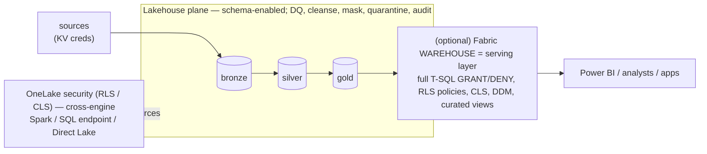

# Data Governance & Security

How the control plane governs and secures data — **what we've implemented**, **what the Fabric
Lakehouse can do** natively, and **what a Fabric Warehouse adds** if we introduce a serving layer.

---

## 1. Principles

- **Config-as-code & promotable.** Security and governance are *declared* (rows in `config_db`,
  promoted as YAML), not clicked in a UI — so DEV → UAT → PROD is deterministic and auditable.
- **Least privilege, deny-by-default.** OneLake security grants nothing until a role says so.
- **Defense in depth.** Column hiding, row filtering, masking, and quality/quarantine are layered —
  Microsoft's own guidance is to use RLS + CLS + masking together.
- **No secrets in git or Delta.** Connections live in **Key Vault** (`datasource.secret_name`);
  only the secret *name* is in config. The variable library holds no connection info.
- **Separation of duties.** A deploy **service principal** provisions and reads secrets; humans
  author config; enforcement targets non-privileged **Viewer** identities.

---

## 2. What we've implemented (in this framework)

### 2.1 Code-driven data security — `security_policy` + `cp_security.py`
Security policies are rows in **`dbo.security_policy`** (config-as-code, promoted like `dq_rule`),
applied per environment by **`cp_security.py`**. Four methods, each with a different reach:

| Method (`method`) | Applied by | Enforced on | Use for |
|---|---|---|---|
| **`onelake_cls`** | OneLake data-access **role**, column whitelist (REST API) | **all engines incl. Spark** | hide columns entirely |
| **`onelake_rls`** | OneLake role, **T-SQL row predicate** | all engines incl. Spark | filter rows per principal |
| **`ddm`** | **Dynamic Data Masking** (`ALTER … ADD MASKED WITH` on the SQL endpoint) | SQL endpoint / Power BI | mask values (`email()`, `default()`, `partial()`) |
| **`mask`** | **static mask** cleanse function (silver build) | **everywhere** (stored masked) | irreversible redaction/hash |

Validated end-to-end on a synthetic `silver.hr.employees`: CLS hides `ssn`/`salary`, RLS filters
`region='BC'`, DDM masks `email`/`salary`, applied identically in **DEV / UAT / PROD** from one
`security_policy.yml`. Run: `CP_TARGET_WORKSPACE=<ws> python deploy/cp_security.py apply` (or `show`).

### 2.2 Broader governance already in the framework
| Area | How |
|---|---|
| **Data quality** | `dq_rule` (not_null/min/max/allowed_values/expression); error-severity failures **quarantined** off silver, all results logged to `dq_result`. |
| **Cleansing** | `cleanse_rule` fixes rows before validation (trim/normalize/mask/…). |
| **Schema drift** | Column adds/removes detected + logged (`schema_drift_event`). |
| **Auditability** | Every run + object-load logged (`ingestion_run`, `object_load_run`, `pipeline_run_log`). |
| **Secrets** | Connections in **Key Vault**; resolved at run time by the service principal; nothing in git/Delta. |
| **Controlled onboarding** | Objects are **discovered `is_active=0`** — reviewed and activated deliberately, never silently loaded. |
| **Promotion** | Config (incl. security) is versioned YAML applied per environment — repeatable, reviewable. |

---

## 3. What the Fabric **Lakehouse** can do (native surface)

Our medallion runs on **schema-enabled lakehouses**. The full security surface available there:

| Capability | What it does | Enforced on | We use it? |
|---|---|---|---|
| **OneLake security roles — CLS** | Hide columns (column whitelist) | **all engines incl. Spark, SQL endpoint, Power BI Direct Lake** (GA) | Yes — `onelake_cls` |
| **OneLake security roles — RLS** | T-SQL row predicate per principal | **all engines incl. Spark** (GA) | Yes — `onelake_rls` |
| **Dynamic Data Masking** | Mask values (email/default/random/custom) on the **SQL analytics endpoint**; `GRANT/DENY UNMASK` | SQL endpoint / Power BI (Spark **bypasses**) | Yes — `ddm` |
| **Workspace roles** | Admin / Member / Contributor / Viewer — the first boundary | control-plane + data | Yes (SP admin; Viewer for restricted users) |
| **Item permissions / sharing** | Per-item read/share; ReadAll vs Write | item access | Yes |
| **Sensitivity labels + Microsoft Purview** | Classification, labels, catalog, lineage, DLP, data quality — estate-wide (**see §5**) | governance / compliance plane | Available (not yet wired) |
| **Private networking** | Managed Private Endpoints / private links (incl. on-prem via PLS + ExpressRoute) | connection security | Available (see WORKING_GUIDE §4.11) |

**Lakehouse limitations to know:**
- **Masking is not cross-engine.** OneLake CLS *hides* columns everywhere, but *partial masking*
  (DDM) is enforced only on the **SQL analytics endpoint** — a Spark reader of the Delta bypasses it.
  For masking that must hold on Spark, use the static **`mask`** cleanse (stored masked) or CLS-hide.
- **The lakehouse SQL endpoint is read-only.** You get RLS/CLS (via OneLake security) and DDM, but
  **no `GRANT/DENY` object management, views, or stored procedures** as a security layer there.
- **Enforcement bypasses privileged users.** Admin/Member/Contributor (and table owners, for
  `UNMASK`) see clear data — restricted users must be **Viewers**.

---

## 4. What an additional Fabric **Warehouse** adds

A Fabric **Warehouse** is a *writable* T-SQL store. Standing one up (e.g. as the **serving/gold
layer** for BI and SQL consumers) unlocks the mature SQL Server security model that the lakehouse
SQL endpoint can't offer:

| Capability | Warehouse (T-SQL) | vs. Lakehouse |
|---|---|---|
| **Object-level security** | `GRANT` / `DENY` / `REVOKE` on schemas, tables, views, procedures | Lakehouse: OneLake roles only (no fine-grained T-SQL grants) |
| **Column-level security** | `GRANT SELECT ON t(col)` / `DENY` — true column grants | Lakehouse: CLS-hide via OneLake role |
| **Row-level security** | Native **`CREATE SECURITY POLICY`** + inline predicate functions | Lakehouse: RLS via OneLake role predicate |
| **Dynamic Data Masking** | `ALTER TABLE … ADD MASKED WITH` + `GRANT UNMASK` on a **writable** store | Lakehouse: DDM on the read-only SQL endpoint |
| **Views & stored procedures** | Expose **curated views**, `DENY` base tables — a security abstraction layer | Not available on the lakehouse SQL endpoint |
| **Cross-store queries** | Query the lakehouse from the warehouse via T-SQL (serve gold without copying) | — |

**When to add one:** when the **consumption layer** (Power BI, analysts, downstream apps) needs
fine-grained, T-SQL-native governance — role-based column grants, view-based exposure, stored-proc
access patterns — beyond what OneLake security + DDM give on the lakehouse. It does **not** replace
OneLake security for the **engineering** plane (Spark reads of bronze/silver stay governed by
OneLake CLS/RLS).

---

## 5. Microsoft Purview — estate-wide governance & compliance

The Fabric-native controls above (OneLake security, DDM, our `security_policy`) **enforce access at
query time**. **Microsoft Purview** is the complementary **governance & compliance plane across the
whole data estate** (Fabric, Azure, on-prem, multi-cloud) — it **discovers, classifies, labels, and
monitors** data, and tells you *what* is sensitive so the enforcement layers can protect it. It
integrates **natively with Fabric**: sensitivity labels and lineage appear inside Fabric workspaces
without leaving to the Purview portal. Available today; not yet wired in this framework.

| Capability | What it does | How it fits our framework |
|---|---|---|
| **Unified Catalog / Data Map** | Register **OneLake**, scan Fabric workspaces, auto-catalog every item; business glossary, tagging, curation/**certification** | A searchable catalog + business context over the tables our pipelines build. |
| **Classification** | Auto-detect PII/sensitive columns (built-in + custom classifiers) | Surfaces *which columns* need protection → drives the targets in `security_policy` (CLS/DDM/`mask`). |
| **Sensitivity labels** (Information Protection / MIP) | Label taxonomy (Public → Highly Confidential); **visible in Fabric**, flow downstream to Power BI / exports / Office; optional encryption; label-aware Copilot grounding | Classification-driven protection that travels *with the data*, beyond query-time RLS/CLS. |
| **Data Loss Prevention (DLP)** | Policies detect sensitive data in Fabric (lakehouses, semantic models); **audit → enforce** (alert / restrict) | A guardrail on top of least-privilege — catches exposure our roles didn't anticipate. |
| **Data lineage** | End-to-end across pipelines, notebooks, and reports — shown in Fabric | Complements our run/object audit tables with visual, cross-item lineage. |
| **Data Quality (DQM)** | Scan + **score** data quality, health controls, rules across the estate | Estate-wide quality on top of our per-object `dq_rule`/quarantine. |
| **Insider Risk · eDiscovery · Records · Compliance Manager · Audit** | Risky-activity detection, legal hold, retention, regulatory posture, unified audit log | The regulatory/compliance suite for a pensions data estate. |

**Recommended rollout (audit-first):**
1. Register **OneLake** in the Purview **Data Map**; scan the Fabric workspaces.
2. Define a **sensitivity-label taxonomy** and publish it (labels then appear in Fabric).
3. Run **classification** to find PII/sensitive columns → feed the targets into our `security_policy`.
4. Deploy **DLP** policies in **audit mode**, review, then enforce.
5. Use **catalog + lineage** for discovery/impact analysis and **DQM** for estate-wide quality scoring.

**Division of labour:** *Purview* classifies, labels, catalogs, and monitors (discovery + compliance,
estate-wide); *OneLake security / Warehouse security / our `security_policy`* enforce who can read
what at query time. They compose — Purview says **what is sensitive and labels it**; the enforcement
layers decide **who sees it**.

## 6. Recommended architecture

- **Data-engineering plane (lakehouse):** OneLake security (CLS/RLS enforced on Spark) + our
  `security_policy`/`cp_security` + DQ/cleanse/mask. This is what we've built.
- **Serving plane (optional warehouse):** promote gold into a Warehouse and govern consumption with
  full T-SQL security (views, column grants, security policies). Extend `cp_security.py` with a
  `warehouse_*` method that emits the T-SQL — same config-as-code, same promotion.
- **Cross-cutting:** sensitivity labels + Purview for classification/lineage/DLP; Key Vault for
  secrets; Managed Private Endpoints for private/on-prem connectivity.

---

## 7. Operating notes

- **Testing enforcement:** OneLake CLS/RLS and DDM only bite for **non-privileged** users. To verify
  live, query as a **Viewer** (admins see clear data). `cp_security.py show` lists applied roles +
  `sys.masked_columns` so you can confirm the *definitions* are in place regardless.
- **Promotion:** edit `security_policy` in DEV → `cp_export_config` → commit → `cp_config` + `cp_security`
  on the target env. Role names must be **letters/numbers only**; RLS predicates must be
  **schema-qualified** (`select * from hr.employees where …`).
- **Roadmap (available, not yet wired):** sensitivity labels + Purview integration; a `warehouse_*`
  policy method for a serving warehouse; automated Viewer-based enforcement tests.

---

### Sources
- OneLake security (roles, RLS/CLS, cross-engine): Microsoft Learn — *OneLake security access control model*.
- Dynamic Data Masking (Warehouse & Lakehouse SQL endpoint): Microsoft Learn — *Dynamic Data Masking in Fabric*.
- Warehouse security (GRANT/DENY, RLS security policies, CLS): Microsoft Learn — *Secure your Fabric Data Warehouse*, *Column-level security*, *SQL granular permissions*.
- On-prem connectivity (managed private endpoints): Microsoft Learn — *Connect on-premises data sources using managed private endpoints*.
- Microsoft Purview + Fabric (Data Map, sensitivity labels, DLP, lineage, data quality): Microsoft Learn — *Data governance & security baselines with Microsoft Purview*; Microsoft Purview Unified Catalog for Fabric.
