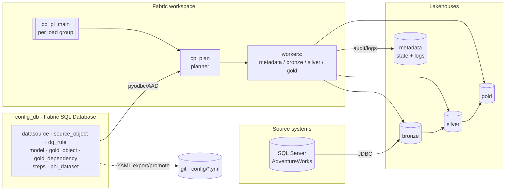
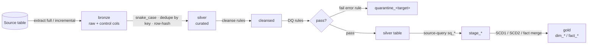
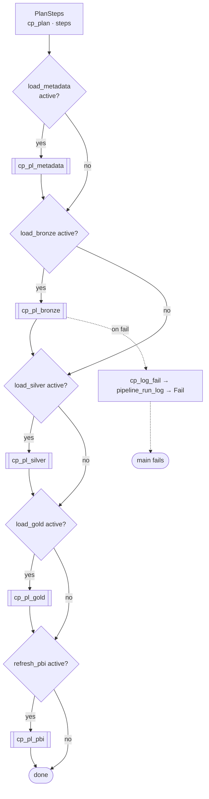
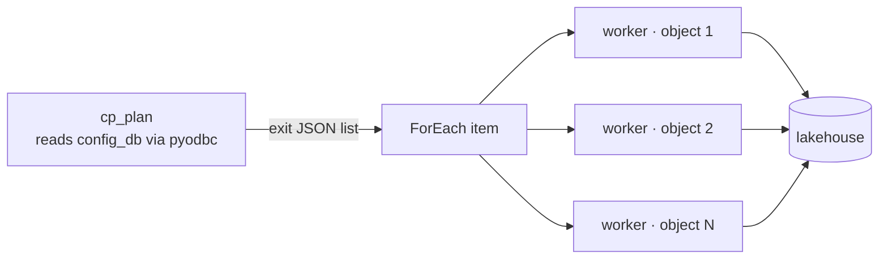
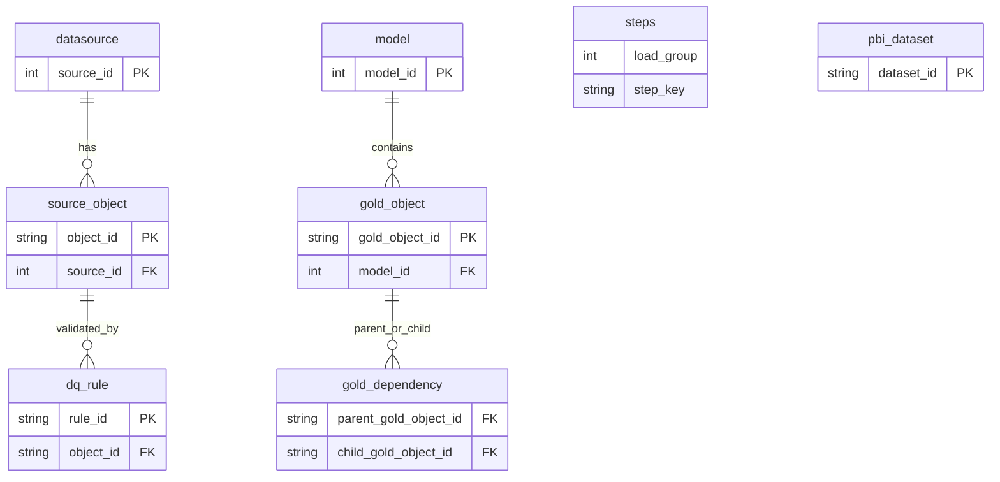
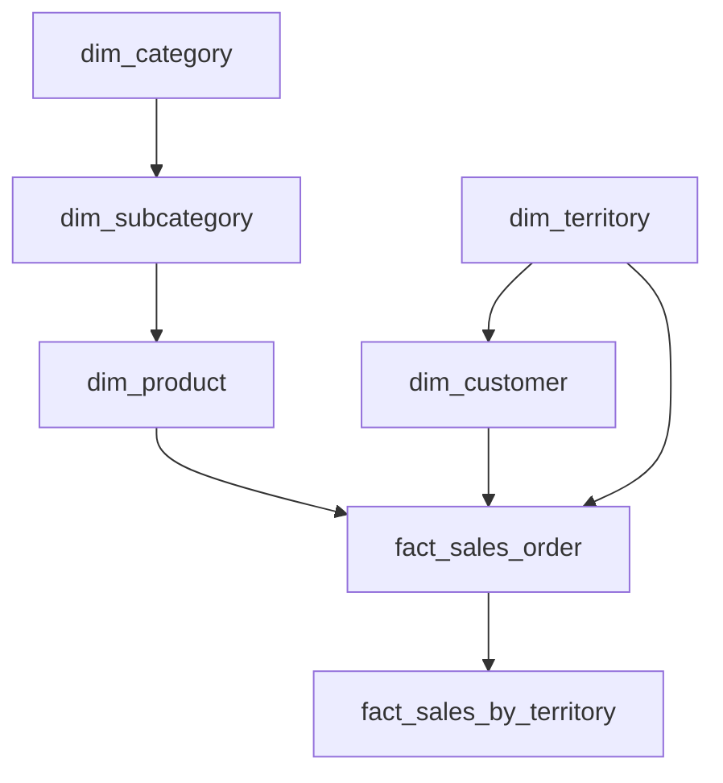
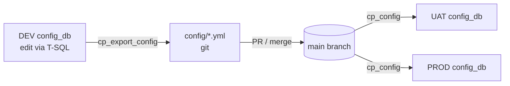
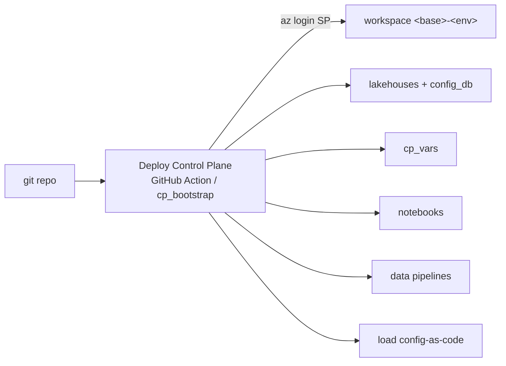

# Fabric Control Plane — Working Guide

A metadata-driven, config-first lakehouse platform for Microsoft Fabric. You describe
**what** to load and build in config tables; the framework does the **how** — extract to
bronze, curate to silver (with data quality), and build a gold star schema — orchestrated
by Fabric Data Pipelines and promotable across environments from git.

---

## 1. Architecture at a glance

```
          ┌────────────────────────── config_db (Fabric SQL Database) ──────────────────────────┐
          │  datasource · source_object · dq_rule · model · gold_object · gold_dependency        │
          │  steps · pbi_dataset            (authored via T-SQL — the source of truth)           │
          └───────────────▲───────────────────────────────────────────────────────┬─────────────┘
                          │ read (pyodbc / AAD)                                     │ promote (YAML)
                          │                                                         ▼
   cp_pl_main (per load group)                                          config/*.yml  (git)
      │  reads `steps`, runs in order, fail-fast, skip inactive
      ├─ cp_pl_metadata → metadata_worker         (discover source schema, drift)
      ├─ cp_pl_bronze   → ForEach object → bronze_worker   ── extract → BRONZE lakehouse
      ├─ cp_pl_silver   → ForEach object → silver_worker   ── dedupe + DQ → SILVER lakehouse
      ├─ cp_pl_gold     → ForEach model  → gold_runner ─ topo DAG ─ sq_* → STAGE → GOLD lakehouse
      └─ cp_pl_pbi      → ForEach dataset → REST refresh  (scaffold)
                          each pipeline logs failures → pipeline_run_log (metadata lakehouse)
```



**Key principles**

- **Config is data, not code.** Authored config lives in `config_db` (T-SQL editable);
  runtime state/logs live in the `metadata` lakehouse. Only authored config is promoted.
- **Items vs data promotion.** Fabric items (notebooks, pipelines, lakehouses, variable
  library) promote together via deployment; config data promotes as YAML (`cp_export_config`
  → git → `cp_config`). Runtime state never promotes.
- **Notebooks are param-driven workers.** They never read config; a planner (`cp_plan`)
  reads config and the pipeline fans work out to the workers.
- **Zero hardcoding.** Workspace + lakehouse IDs resolve at runtime; environment values
  come from the `cp_vars` Variable Library.

---

## 2. Resources and what they do

### 2.1 Lakehouses (medallion + control)
| Lakehouse | Purpose | Contents |
|-----------|---------|----------|
| `bronze`  | Raw landing (as-extracted) | `<source>_<schema>_<table>` Delta tables + control columns |
| `silver`  | Curated, deduped, DQ-passed | same table names; snake_case cols, `_row_hash`, `_silver_*`; plus `quarantine_<target>` for DQ failures |
| `gold`    | Star schema (business) | `dim_*` / `fact_*`; plus `stage_*` (pre-merge staging) |
| `metadata`| Runtime state + logs + config mirror | audit/state tables (below); Files hold error tracebacks |



### 2.2 config_db (Fabric SQL Database)
Holds the **authored config** tables (section 4). Edited with T-SQL. Auto-mirrors to
OneLake so Spark can also read it; tooling reads/writes via `pyodbc` + Entra token.

### 2.3 Variable Library `cp_vars`
Per-environment values, swappable via value sets: `config_lakehouse`, `bronze_lakehouse`,
`silver_lakehouse`, `gold_lakehouse`, `source_server`, `source_connection`. Notebooks read
it at runtime (`notebookutils.variableLibrary`).

### 2.4 Notebooks
| Notebook | Folder | Role | Key parameters |
|----------|--------|------|----------------|
| `cp_framework` | utility | Shared library (`%run` by all): paths, config read (pyodbc), JDBC, Delta helpers, watermark, DQ helpers, gold writers (SCD1/2/fact), DAG topo-sort, audit/log helpers | — |
| `cp_plan` | utility | Reads config_db, returns the ForEach work-list | `load_group`, `plan_type` (objects\|models\|steps\|datasets) |
| `cp_log_fail` | utility | Writes a failure row to `pipeline_run_log` | `pipeline_name, run_id, load_group, activity, message` |
| `metadata_worker` | notebook | Start run; discover source schema; log drift; snapshot `source_column` | `run_id, load_group, src_user, src_password` |
| `bronze_worker` | notebook | Extract ONE object to bronze (full/incremental) | `run_id, object_json, src_user, src_password` |
| `silver_worker` | notebook | Build silver for ONE object: dedupe, row-hash, DQ→quarantine | `run_id, object_json` |
| `gold_runner` | notebook | Build ONE model's gold objects in dependency order (runs its `sq_*`) | `run_id, model_id` |
| `sq_*` | sourcequery | Source-query builder per gold object: silver → stage → gold merge | `run_id` |

### 2.5 Pipelines (Fabric Data Pipelines, `pipeline` folder)
| Pipeline | Purpose | Parameters |
|----------|---------|-----------|
| `cp_pl_main` | Orchestrator per load group: read `steps`, run the 5 steps in order, skip inactive, fail-fast | `load_group, run_id, src_user, src_password` |
| `cp_pl_metadata` | Runs `metadata_worker` | `load_group, run_id, src_user, src_password` |
| `cp_pl_bronze` | `cp_plan(objects)` → ForEach → `bronze_worker` | `load_group, run_id, src_user, src_password` |
| `cp_pl_silver` | `cp_plan(objects)` → ForEach → `silver_worker` | `load_group, run_id` |
| `cp_pl_gold` | `cp_plan(models)` → ForEach → `gold_runner` | `load_group, run_id` |
| `cp_pl_pbi` | `cp_plan(datasets)` → ForEach → Power BI REST refresh (scaffold) | `load_group, run_id` |

Every pipeline: on a work-activity failure → `cp_log_fail` writes to `pipeline_run_log`,
then a `Fail` activity re-fails so `cp_pl_main` errors out (fail-fast).

**Orchestration (main → children, sequential, is_active-gated, fail-fast):**


**Planner–worker pattern (inside a child pipeline):**


---

## 3. How to operate

### Deploy an environment
```bash
az login --tenant <tenant> --scope https://api.fabric.microsoft.com/.default --allow-no-subscriptions
python control_plane/deploy/cp_bootstrap.py HackathonShuo DEV     # or UAT / PROD
```
Idempotent, deploy-only: provisions workspace/lakehouses/`config_db`, deploys the variable
library + notebooks + pipelines (organized into folders), loads config-as-code. Or run the
**Deploy Control Plane** GitHub Action (needs the SP secrets).

### Run the pipeline
Trigger `cp_pl_main` (schedule or on demand), per load group:
```
cp_pl_main(load_group=1, run_id="run1", src_user=<u>, src_password=<p>)
```
> Trial capacity note: don't run two full pipelines on one capacity at once — Spark session
> slots are limited. Run environments sequentially (or use separate/larger capacities).

### Author / change config (T-SQL in `config_db`)
Edit the tables directly, then snapshot to git for promotion:
```bash
python control_plane/deploy/cp_export_config.py     # config_db -> config/*.yml  (commit)
python control_plane/deploy/cp_config.py            # config/*.yml -> target config_db (promote)
```

### Common changes
- **Add a source object to load:** insert into `source_object` (+ its `datasource`).
- **Add a DQ rule:** insert into `dq_rule` (section 4.3).
- **Add a gold table:** create a `sq_<name>` source-query notebook, insert into `gold_object`
  (+ `gold_dependency`), deploy.
- **Turn a step on/off:** flip `steps.is_active`.

---

## 4. config_db table reference (authored config)

`is_active` is a `BIT` (1/0) on every authored table; only active rows are processed.
Standard/enumerated values are called out in **bold**.



### 4.1 `datasource` — source systems
| Column | Type | Notes / allowed values |
|--------|------|------------------------|
| `source_id` | INT PK **IDENTITY** | auto-assigned — never insert by hand; use `SCOPE_IDENTITY()` for the FK. `cp_config` preserves ids across envs via `IDENTITY_INSERT`. |
| `source_name` | str | display name (stamped into bronze `_source_system`) |
| `source_type` | str | free-text descriptor (e.g. `SQL`, `API`) |
| `database_name` | str | source database (JDBC/ODBC) |
| `load_group` | INT | the run unit; `cp_pl_main` runs one load group |
| `ingestion_mode` | str | descriptor (e.g. `custom_jdbc`, `api`) |
| `is_active` | BIT | |
| `connector` | str | **which ingest connector to use** — `sqlserver` · `oracle` · `db2` · `postgresql` · `mysql` · `jdbc` · `odbc` · `http` (=`rest_api`=`api`=`statcan_wds`) (see §4.9). Falls back to `source_type` if null. |
| `connection_json` | str(JSON) | **non-secret** connector overrides (e.g. `mode:"jdbc"`, `base_url`, HTTP discovery `tables`). Secrets go in the KV secret, not here. |
| `secret_name` | str | **Key Vault secret** holding the complete connection (creds/host/db or HTTP base-url+auth). Resolved at runtime; only the *name* is in config. See §4.9. |

### 4.2 `source_object` — objects to ingest
| Column | Type | Notes / allowed values |
|--------|------|------------------------|
| `object_id` | str PK | stable logical id. **Auto-set by discovery** (`{source}_{schema}_{table}`) — objects are discovered, not hand-authored (§4.9). |
| `source_id` | INT FK→datasource | |
| `source_schema`, `source_table` | str | source location (schema optional; defaults to `dbo` in the landed name) |
| `target_name` | str | explicit bronze/silver Delta table name. **Optional** — if null, the name is derived (see naming convention below) |
| `load_type` | str | **`full`** = overwrite each run · **`incremental`** = append rows past the watermark |
| `key_columns_json` | str(JSON) | business key(s), source-case JSON array, e.g. `["SalesOrderID","SalesOrderDetailID"]` (used for silver dedupe/upsert; snake_cased internally) |
| `watermark_column` | str | column used for incremental (e.g. `ModifiedDate`) |
| `watermark_type` | str | **`datetime`** |
| `processing_state` | str | **`ACTIVE`** (only ACTIVE objects run) |
| `is_active` | BIT | |
| `source_options_json` | str(JSON) | per-object connector options: `query`, `filters`, `select` (schema selection); HTTP `url`/`params`/`response`/`method`/`body` (see §4.9) |
| `suffix` | str | optional tag appended to the derived table name (e.g. `bc`) |

**Landed-table naming.** When `target_name` is null, the bronze/silver table name is derived as
`{source_name}_{source_schema|dbo}_{source_table}[_{suffix}]`, lowercased/underscored — e.g.
source `stats_can`, schema null→`dbo`, table `labour_force`, suffix `bc` →
**`stats_can_dbo_labour_force_bc`**. This namespaces every source's tables consistently (the
existing AdventureWorks tables set `target_name` explicitly, which still wins).

**Incremental semantics:** first run (no stored watermark) pulls everything and records
`max(watermark_column)`; later runs pull `WHERE watermark_column > stored` and append.
Full loads overwrite. Complex source types (xml/geography/geometry/hierarchyid/varbinary/
image/sql_variant) are excluded automatically.

### 4.3 `dq_rule` — data-quality rules (evaluated on silver)
Rules are evaluated per object during `silver_worker`. **`column_name` is the SILVER column
(snake_case)**, e.g. `total_due`, `customer_id`.

| Column | Type | Notes |
|--------|------|-------|
| `rule_id` | str PK | unique |
| `object_id` | str FK→source_object | which object |
| `column_name` | str | target column (snake_case); optional for `expression` |
| `rule_type` | str | **see below** |
| `allowed_values_json` | str(JSON) | for `allowed_values` |
| `min_value` | float | for `min` |
| `max_value` | float | for `max` |
| `rule_expression` | str | for `expression` (Spark SQL boolean, TRUE = pass) |
| `severity` | str | **`error`** = failing rows quarantined & excluded from silver · **`warn`** = counted only |
| `is_active` | BIT | |

**Allowed `rule_type` and how to author each** (a row "passes" when the condition holds):

| `rule_type` | Fill these columns | Passes when | Example |
|-------------|--------------------|-------------|---------|
| `not_null` | `column_name` | column IS NOT NULL | `('cust_pk','customer','customer_id','not_null',...,'error',1)` |
| `min` | `column_name`, `min_value` | column ≥ min (NULL passes) | `total_due ≥ 0` |
| `max` | `column_name`, `max_value` | column ≤ max (NULL passes) | `discount ≤ 1` |
| `allowed_values` | `column_name`, `allowed_values_json` | column ∈ list (NULL passes) | `person_type ∈ ["EM","IN",...]` |
| `expression` | `rule_expression` (column_name optional) | the boolean expression is TRUE | `order_qty > 0 AND unit_price >= 0` |

Every rule's pass/fail counts are recorded in `dq_result`. Rows failing any **error** rule
are written to `quarantine_<target>` (silver lakehouse) and kept out of silver; **warn**
rules never quarantine.

Authoring example (T-SQL):
```sql
INSERT INTO dbo.dq_rule (rule_id, object_id, column_name, rule_type, min_value, severity, is_active)
VALUES ('soh_total_due_nonneg','sales_order_header','total_due','min',0,'error',1);

INSERT INTO dbo.dq_rule (rule_id, object_id, column_name, rule_type, allowed_values_json, severity, is_active)
VALUES ('person_type_allowed','person','person_type','allowed_values','["EM","IN","SP","SC","VC","GC"]','error',1);
```

### 4.3b `cleanse_rule` — cleansing (transform) rules

Cleansing **fixes** rows on silver, applied **before** DQ validation (in `apply_order`).
`columns` is a semicolon-separated list of SILVER (snake_case) columns; `parameters_json`
holds function params. Extensible via `register_cleanse_function()`.

| Column | Notes |
|--------|-------|
| `rule_id` (PK) | unique |
| `object_id` (FK) | → source_object |
| `function` | **`trim` · `normalize_text` · `fill_nulls` · `parse_datetime` · `to_upper` · `to_lower` · `to_title` · `replace`** |
| `columns` | `col1;col2` (silver snake_case) |
| `parameters_json` | function params (JSON) |
| `apply_order` | INT — order of application |
| `is_active` | BIT |

**Functions & params**

| `function` | Params | Effect |
|-----------|--------|--------|
| `trim` | — | trim whitespace |
| `normalize_text` | `case` (lower/upper/title), `collapse_spaces`, `empty_as_null` | trim + collapse spaces + case + ""→null |
| `fill_nulls` | `default` | replace null with default |
| `parse_datetime` | `target_type` (date/timestamp), `formats` [..], `into`, | parse string to date/timestamp (first matching format) |
| `to_upper` / `to_lower` / `to_title` | — | casing |
| `replace` | `pattern`, `replacement` | regex replace |

Example (T-SQL):
```sql
INSERT INTO dbo.cleanse_rule (rule_id, object_id, [function], [columns], parameters_json, apply_order, is_active)
VALUES ('person_names_title','person','normalize_text','first_name;last_name',
        '{"case":"title","collapse_spaces":true,"empty_as_null":true}',1,1);
```
> `function` and `columns` are T-SQL reserved words — bracket-quote them (`[function]`, `[columns]`).
> **Cleanse fixes; DQ validates.** Cleansing runs first, then error-severity DQ rules quarantine what's still bad.

### 4.4 `model` — gold data models
| Column | Type | Notes |
|--------|------|-------|
| `model_id` | INT PK | |
| `model_name` | str | e.g. `sales_star` |
| `load_group` | INT | gold-phase load group |
| `is_active` | BIT | |

### 4.5 `gold_object` — gold tables
| Column | Type | Notes / allowed values |
|--------|------|------------------------|
| `gold_object_id` | str PK | e.g. `dim_customer` |
| `model_id` | INT FK→model | |
| `gold_type` | str | **`scd1`** (upsert/overwrite by key) · **`scd2`** (history: `_is_current`, `_effective_start/end_ts`, `_row_hash`) · **`fact`** (upsert by key) |
| `stage_table` | str | staging table name (written to `stage_*` in gold) |
| `gold_table` | str | final gold table name |
| `business_key_columns_json` | str(JSON) | key(s), snake_case, e.g. `["product_key"]` or `["sales_order_id","sales_order_detail_id"]` |
| `source_query_notebook` | str | the `sq_*` notebook that builds this object's stage |
| `is_active` | BIT | |

### 4.6 `gold_dependency` — build order (DAG)
| Column | Notes |
|--------|-------|
| `parent_gold_object_id` | must be built first |
| `child_gold_object_id`  | built after parent |

`gold_runner` topo-sorts these; dimensions before facts, snowflake parents before children.

**Example DAG (`sales_star` model) — the order `gold_runner` derives:**


### 4.7 `steps` — orchestration steps per load group
| Column | Notes / allowed values |
|--------|------------------------|
| `load_group` | INT |
| `step_order` | 1..5 (execution order) |
| `step_key` | **`load_metadata` · `load_bronze` · `load_silver` · `load_gold` · `refresh_pbi`** |
| `child_pipeline` | pipeline to invoke (`cp_pl_metadata`/`bronze`/`silver`/`gold`/`pbi`) |
| `is_active` | BIT — inactive steps are skipped |

### 4.8 `pbi_dataset` — Power BI refresh targets (scaffold)
| Column | Notes |
|--------|-------|
| `dataset_id` PK, `workspace_id`, `dataset_name`, `load_group`, `is_active` | REST refresh issued per active row |

### 4.9 Ingestion connectors & adding a source

Bronze ingestion is **connector-dispatched**: each `datasource` declares a `connector`, and
`bronze_worker` calls the matching function from the registry in `cp_framework`
(`INGEST_CONNECTORS`). A connector fetches the raw extract; `apply_select` then shapes the
landed schema; control columns are added; the row lands in bronze. Silver is source-agnostic
(it just reads the bronze table), so **a new source needs no notebook/pipeline changes — only
config**. Add your own with `register_ingest_connector(name, fn)`.

| `connector` | Reads | `connection_json` | Driver / setup |
|-------------|-------|-------------------|----------------|
| `sqlserver` | SQL Server via Spark JDBC (complex types pruned; incremental watermark) | `{host,port,database}` or `{url,driver}`; falls back to the `cp_vars` `source_server` | **bundled — zero setup** (validated: AdventureWorks) |
| `postgresql` · `mysql` | that dialect via Spark JDBC (distributed) | `{host,port,database}` (or `{url,driver}`) | **jar bundled in the Fabric runtime — zero setup** |
| `oracle` · `db2` | **default:** pure-Python driver-side (`oracledb` thin / `ibm_db`), **self-installing** on first use; **opt-in:** distributed Spark JDBC via `connection_json.mode:"jdbc"` | `{host,port,database/service}`; add `mode:"jdbc"` for the JDBC path | **plug-and-play** (driver pip-installs on demand — validated in Fabric). JDBC mode needs the ojdbc/db2jcc jar on an Environment. |
| `jdbc` | any JDBC via explicit url+driver | `{url,driver}` | needs that driver jar on an Environment |
| `odbc` | pyodbc on the driver node (modest volumes) | `{odbc:"<conn string with {user}/{password}>"}` | needs the platform ODBC driver/DSN |
| `http` (= `rest_api` = `api` = `statcan_wds`) | **one generalized HTTP/API connector** for every API (like a Data Factory HTTP connector). Request is parameters (§below); response handling is a parameter — `json` / `csv` / `zip_csv`. StatCan is just `response:zip_csv`. | KV secret / `{base_url, headers}` for auth | zero setup (validated) |

**Credentials / connections** are never stored in config. A datasource points at a **Key Vault
secret** via **`secret_name`**; the secret's value is the complete connection payload
(`{host,port,database,user,password,…}` JSON or a raw connection string, or for HTTP `{base_url,headers}`).
`cp_framework.get_secret` reads it via the running identity (**the SPN**, which has KV *get*);
`_resolve_conn` layers `connection_json` on top for non-secret overrides. `src_user`/`src_password`
remain as a fallback. Vault URL = the `cp_vars` variable `key_vault_url`. Only the secret *name* is
in YAML/git — never the value.

**Driver availability — plug-and-play.** SQL Server / Postgres / MySQL JDBC jars are already
in the Fabric runtime, so those connectors need **no setup**. Oracle/DB2 have no bundled driver,
so the connectors **self-install** their pure-Python driver (`oracledb` thin mode = no Oracle
client; `ibm_db` = bundled client) into the session on first use — still zero manual setup,
reading driver-side (good for modest–moderate volumes). For **distributed** Spark JDBC on large
Oracle/DB2 tables, set `connection_json.mode:"jdbc"` and provide the driver jar via a Fabric
**Environment**: uncomment the `environment` block in `deploy/manifest.yml`
(`{name, pip:[oracledb,ibm_db], jars:[…ojdbc11.jar…], attach:[bronze_worker], set_default}`) and
`cp_bootstrap` creates, uploads, publishes it and (optionally) sets it as the workspace default
via `cp_environment.py`. The jars are proprietary — drop them in `control_plane/deploy/jars/`
(licensing is on you).

**Deploy ordering (important for promotion to a new workspace).** A notebook bound to an
Environment fails at run time if that Environment isn't published yet, so the order is a hard
invariant: `cp_bootstrap` **provisions + publishes the Environment (blocking) BEFORE it deploys
the notebooks**, and aborts the whole deploy if the publish isn't confirmed. Only the notebooks
in `environment.attach` (default `[bronze_worker]`, the connector runner) are bound to the env —
so just those pay the session-startup cost; the rest run on default compute. The binding uses the
**per-workspace** Environment id resolved at deploy time (no hardcoded ids), so promotion to a
fresh workspace re-creates and re-binds correctly. When no `environment` block is set, notebooks
deploy unbound and Oracle/DB2 use the self-install path.

**`source_options_json`** (per source object) carries:
- `query` — explicit extract SQL (JDBC/ODBC), overrides schema/table
- `filters` — `{column: value}` equality filters applied **at ingest** to land a **subset** (see below)
- `select` — **schema selection**: control exactly which columns land, their order/names/types.
  Forms: `["colA","colB"]` (projection) · `[{"source":"C","name":"c","type":"double"}]` ·
  `{"columns":[...],"rename":{src:new},"cast":{col:type}}`. Names are the connector's raw
  output columns; silver still snake_cases afterward. No `select` → land the full schema.
- **HTTP** (any API): `url`/`path` (with `{name}` templating from `params`), `method`, `query`,
  `body`, `headers`, and **`response`** — `{type:"json", record_path}` · `{type:"csv"}` ·
  `{type:"zip_csv", url_field, exclude}` (follow a JSON pointer to a ZIP, read the CSV). StatCan =
  `url` template + `params:{table_id,language}` + `response:zip_csv` + `filters` (on **original**
  column names). Auth/base-url for a private API go in the KV secret.

**Objects are discovered, not hand-authored.** The **metadata step** enumerates a datasource and
**registers `source_object` rows as `is_active=0`** (never clobbering existing tweaks); you then set
filters/select and activate. SQL Server: every base table (+ keys from the PK). HTTP: one object per
`table_id`/resource declared in the datasource. So the flow is: register the *datasource* → run
`cp_pl_metadata` → tweak + activate the object → run `cp_pl_bronze/silver`. `source_id` is
`IDENTITY` (auto); use `SCOPE_IDENTITY()` if you ever insert a datasource by hand.

The full worked StatCan example (register datasource → discover → tweak+activate, with the generic
`http` params) is in **`docs/RUNBOOK_statcan.md`**. Its `filters` land only the **32,724-row** BC
slice as `stats_can_dbo_labour_force_bc` (full table ~5.4M rows).

---

## 5. Runtime state / log tables (generated — do not author, never promoted)

In the `metadata` lakehouse (Delta), written by the framework:

| Table | What it records |
|-------|-----------------|
| `ingestion_run` | one row per run start/finish (run_id, status) |
| `object_load_run` | per object × layer: status + source/target/quarantine counts |
| `watermark_state` | latest watermark per object (incremental) |
| `source_column` | discovered source schema snapshot (drift baseline) |
| `schema_drift_event` | column added/removed vs previous snapshot |
| `dq_result` | per rule: passed/failed counts, PASS/FAIL |
| `quarantine_<target>` | (silver lakehouse) rows that failed an error-severity DQ rule |
| `pipeline_run_log` | pipeline failures (pipeline, activity, error message) |

Control columns on data tables: bronze `_run_id, _source_system, _source_table,
_bronze_ingest_ts`; silver `_row_hash, _silver_run_id, _silver_updated_at`; gold
`_gold_run_id, _gold_updated_at` and (SCD2) `_is_current, _effective_start_ts,
_effective_end_ts`.

---

## 6. Promotion & environments

**Config authoring & promotion loop (tables are the source of truth):**


**Deployment (items) per environment:**



**Manifest-driven deploy (`deploy/manifest.yml`):** one declarative inventory — *names only,
IDs resolved at runtime* — drives the whole deploy. It lists the `lakehouses`, `sql_database`,
`variable_library`, `notebooks` (each `{name, folder}`, in deploy order — framework first,
others `%run` it), `pipelines` (children before `cp_pl_main`), and `superseded_notebooks`
(pruned from every environment). `cp_manifest.py` loads it (standalone, no side effects) and
feeds `cp_bootstrap` / `cp_deploy` / `cp_pipeline`, so adding a notebook/pipeline or changing
folder layout is a one-line manifest edit — no code change.

- Items (notebooks/pipelines/lakehouses/variable library) deploy per environment via the
  bootstrap or CI/CD; naming is `<workspace_base>-<environment>` (e.g. `HackathonShuo-UAT`).
- Environment values come from `cp_vars` value sets; deploy parameters from
  `environments/<env>.yml` (workspace_base, environment, tenant_id, capacity_id).
- Config data promotes as YAML: `cp_export_config` (SQL→YAML, commit) then `cp_config`
  (YAML→target SQL). Runtime state stays per-environment.
- Secrets: source password is passed at run time (CI secret store); the SP client id/secret
  drive CI auth. Key Vault + native pipeline SQL Lookups are the planned upgrades once an SP
  exists (see `portability-design.md`).
