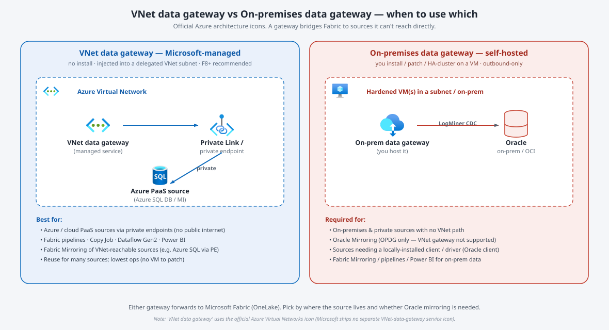
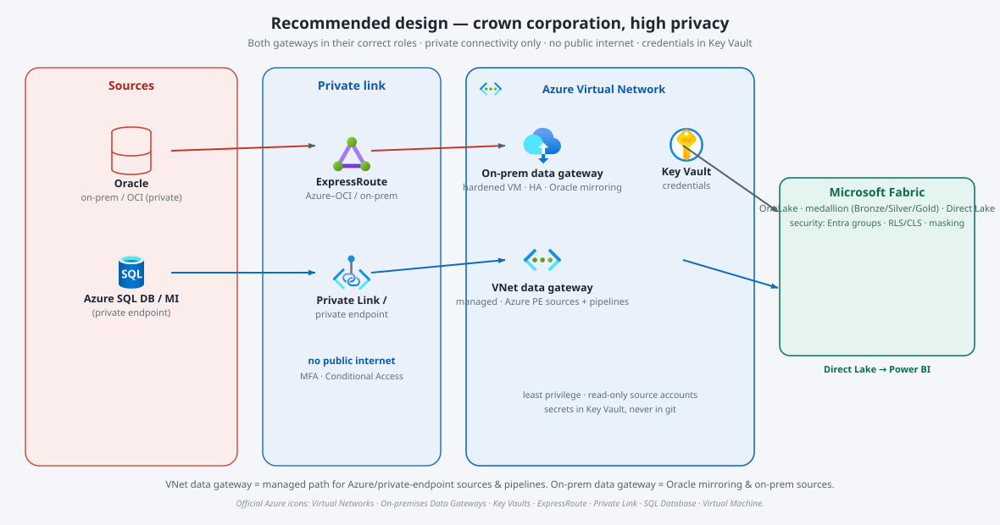

# Fabric Gateway Design Guide — VNet data gateway vs On-premises data gateway

**Purpose.** Decide **when to use the Virtual Network (VNet) data gateway vs the on-premises data
gateway** to connect Microsoft Fabric to BC Pension Corporation's data sources, what that choice means
in the **short and long term**, and the **correct design for a crown corporation with high privacy
requirements**.

**Verification date:** 2026-07-28. Gateway capabilities are cited from official Microsoft documentation
(see *References*). Diagrams use the **official Azure architecture icons** (permitted for use in
architecture diagrams; not cropped, rotated, or distorted).

---

## 1. Executive recommendation

Use **both**, each for its correct role — they are complementary, not competing.

- **VNet data gateway** = the **Microsoft-managed** path for **Azure / cloud sources reachable over a
  private endpoint or the virtual network**. No software to install, no VM to patch, compute isolation,
  and it works with **Fabric pipelines, Copy Job, Dataflow Gen2, Fabric Mirroring, and Power BI**. Prefer
  it whenever the source can be reached privately through an Azure VNet.
- **On-premises data gateway (OPDG)** = the **self-hosted** path for **on-premises / private sources with
  no VNet route**, and — critically for BCPC — the **only supported gateway for Oracle mirroring**.

**For BCPC:** reuse the **existing VNet data gateway** for Azure/private-endpoint sources and pipeline
ingestion; stand up a **dedicated, HA on-premises data gateway** specifically for **Oracle (OCI / on-prem)
mirroring** and any other on-prem sources. Keep everything on **private connectivity, no public internet**.

> **One-line rule.** *If the source is reachable privately through an Azure VNet → VNet data gateway.
> If it's on-prem/private with no VNet path, or it's Oracle mirroring → on-premises data gateway.*

---

## 2. What each gateway is (verified)

**Virtual Network (VNet) data gateway** — *a Microsoft-managed service; nothing to install.*

- "A virtual network data gateway lets you connect your **Azure and other data services** to Microsoft
  Fabric and the Power Platform."
- **Supported workloads:** "Fabric Dataflow Gen2, Fabric data pipelines, **Fabric Copy Job, Fabric
  Mirroring**, Power BI semantic models, and Power BI paginated reports." *(Power BI dataflows and
  datamarts aren't supported.)*
- **Managed & private:** "No installation is required because it's a Microsoft managed service." It is
  **injected into your virtual network and subnet** and operates in the same region as the VNet. "Can be
  used with **private endpoints** for Azure data sources to ensure that **no traffic is ever exposed to a
  public endpoint**." Supports **Private Link**; "provides compute isolation enhancing security from cross
  tenant attacks." "Hardware is fully managed … a **more cost effective alternative** to the on-premises
  data gateway."
- **Reach:** private endpoints (private), or public endpoints for Azure/other-cloud/on-prem sources.
- **Requirements:** available for **P, F, and A4+** SKUs; for F SKUs, **F8 and above recommended** (all F
  work). Can't change the gateway's region/subscription/resource group after creation. Limit of **1,000
  data sources** per gateway.

**On-premises data gateway (OPDG)** — *a locally installed client you host and manage.*

- "The on-premises data gateway is a **locally installed Windows client application** that acts as a bridge
  between your **local on-premises data sources** and services in the Microsoft cloud."
- **Outbound-only:** "requires **no inbound ports** to your network — only outbound ports." All cloud
  communication arrives as responses to the gateway's outbound polling.
- **Supported services:** "Azure Analysis Services, Azure Data Factory, Azure Logic Apps, **Microsoft
  Fabric**, Power Apps, Power Automate, and Power BI."
- **Modes / HA:** standard (multi-user, multi-source) and personal (single user, Power BI only); supports
  **high-availability clustering**; can be installed on an **Azure VM** to reach VNet resources. Limit of
  **1,000 data sources** per cluster. You install, configure, and patch it (Microsoft supports the **last
  six monthly releases**).

**The Oracle nuance (important):** although the VNet gateway supports "Fabric Mirroring" in general,
**Oracle mirroring specifically requires the on-premises data gateway** — "We currently support Mirroring
for Oracle for **On-Premises Data Gateway (OPDG)** … version **3000.282.5** or greater." So for BCPC's
Oracle estate (OCI / on-prem), the OPDG is mandatory.

---

## 3. Comparison at a glance

| Dimension | **VNet data gateway** | **On-premises data gateway** |
|---|---|---|
| Hosting / management | **Microsoft-managed** — no install, no VM to patch | **You host** it (Windows VM), patch monthly, run HA cluster |
| Where it lives | Injected into a **delegated subnet** of your Azure VNet | A machine you own (on-prem or an Azure VM) |
| Reaches | Azure/cloud sources via **private endpoint / VNet** (or public) | **On-prem & private** sources; VNet resources if on an Azure VM |
| Private connectivity | **Private endpoints / Private Link** — no public exposure | Outbound-only; private via your own network (ExpressRoute/VPN) |
| Fabric workloads | Dataflow Gen2, pipelines, Copy Job, **Mirroring**, Power BI | Data Factory (pipelines), **Mirroring**, Power BI, Logic Apps, AAS |
| **Oracle mirroring** | **Not supported** for Oracle | **Required** (OPDG 3000.282.5+) |
| High availability | Managed by Microsoft | **You cluster** the gateway VMs |
| SKU requirement | P / F / A4+; **F8+ recommended** | Any (a gateway licence/VM) |
| Compute isolation | **Yes** (cross-tenant isolation) | Depends on your VM hardening |
| Cost / ops profile | Lower ops; managed hardware | You own VM cost, patching, HA, monitoring |
| Data-source limit | 1,000 per gateway | 1,000 per cluster |

**Decision rules**

1. Source is **Oracle** (OCI/on-prem) and you want **mirroring** → **on-premises data gateway** (mandatory).
2. Source is **on-prem / private with no VNet route** → **on-premises data gateway**.
3. Source is **Azure PaaS / cloud reachable via private endpoint or the VNet** → **VNet data gateway**.
4. You want the **lowest operational overhead** (no VM to run/patch/HA) and the source qualifies → **VNet
   data gateway**.
5. Native cloud sources (e.g. Azure SQL Database) with a **public** path can mirror **without any gateway**;
   add the VNet gateway only to force **private-endpoint** connectivity.

---

## 4. What it means for BCPC — short term vs long term

**Short term**

- **Reuse the existing VNet data gateway** (already running for Power BI) for **Azure / private-endpoint
  sources** and for **framework pipeline / Copy ingestion** — no new infrastructure.
- **Stand up a dedicated on-premises data gateway** *only* where it's required: **Oracle (OCI/on-prem)
  mirroring** and any on-prem sources. Size it, place it on a hardened VM, and plan for HA.
- Don't force everything onto one gateway: put each source on the gateway that fits (rule set in §3).
- Confirm capacity: VNet gateway wants **F8+**; BCPC's **F64** is well above that.

**Long term**

- Treat the **VNet data gateway as the default managed path**; minimise self-hosted gateway sprawl.
- Keep a **single, well-run HA OPDG cluster** dedicated to Oracle / on-prem; as sources migrate to Azure
  or expose **private endpoints**, shift them to the VNet gateway and **shrink OPDG dependence**.
- Establish an **operational cadence**: monthly OPDG patching, version currency (Microsoft supports the
  last six releases), gateway health monitoring, and capacity/CU monitoring.
- Move to **private endpoints everywhere** and **retire public data paths**; standardise on ExpressRoute /
  Private Link for cross-network reach.
- Govern **who can create gateways/connections** and where credentials live (Key Vault), as part of the
  crown-corporation security model.

---

## 5. Correct design for a crown corporation (high privacy)

Principles, mapped to the design above:

- **Private connectivity only — no public internet.** Reach Azure PaaS sources over **Private Link /
  private endpoints**; reach OCI / on-prem over **ExpressRoute** (or Azure–OCI interconnect) into the VNet.
  The VNet data gateway can be configured so **no traffic is ever exposed to a public endpoint**.
- **VNet data gateway** (managed, injected into a **hardened delegated subnet**) for **Azure / private-
  endpoint sources** and Fabric **pipelines / Copy / Dataflow Gen2** — least operational surface, compute
  isolation from cross-tenant attacks.
- **On-premises data gateway** on **dedicated, hardened, HA-clustered VM(s)** in a secured subnet, used
  **only** for **Oracle mirroring** and on-prem sources. Outbound-only (no inbound ports). Dedicate the VMs
  to the gateway; patch monthly.
- **Credentials in Key Vault** — least-privilege, **read-only** source accounts; secrets never in config or
  git.
- **Identity & access** — grant via **Entra security groups**; enforce **Conditional Access** (MFA +
  compliant device + allowed location) on Fabric access; **PIM** for privileged / production roles.
- **In Fabric** — govern with **OneLake row/column security and masking**; keep sensitive data controlled
  as it lands. (See the companion *Bronze vs Mirroring* and *Fabric ingestion decision* guides.)
- **Data residency** — host the Fabric capacity and gateway VMs in a **Canadian region** (Canada Central /
  East); keep the private path in-region.
- **Monitoring** — gateway health, version currency, F64 CU usage, and mirrored-footprint vs the F64
  allowance.

This gives BCPC a design where **every source path is private**, the **managed gateway carries the
low-ops Azure workload**, and the **self-hosted gateway is a small, hardened, HA footprint dedicated to
Oracle** — the minimum attack surface for a crown corporation.

---

## 6. Cost & operational implications

- **VNet data gateway:** Microsoft-managed hardware — "a more cost effective alternative to the on-premises
  data gateway"; **no VM to run or patch**. Requires **F8+** (BCPC's F64 qualifies). Query compute runs on
  your Fabric capacity as normal.
- **On-premises data gateway:** you bear **VM cost, patching, HA clustering, and monitoring**; it is **not**
  covered by the Fabric capacity reservation. Dedicate the VM(s) to the gateway for stability (per Oracle
  mirroring guidance).
- **Neither gateway is a data store** — storage and Fabric compute are billed as usual (see the *Fabric
  ingestion decision guide* cost model).
- **Least privilege everywhere:** read-only source accounts via the gateway; note that **Oracle mirroring
  requires broad grants** (`SELECT ANY TABLE`, `SELECT ANY DICTIONARY`, `LOGMINING`, `FLASHBACK ANY TABLE`)
  — a further reason to isolate the OPDG and its credentials.

---

## 7. Reconciliation with earlier guidance

An earlier note stated the VNet gateway "can't serve mirroring." That is **correct for Oracle**
(OPDG-only) but **too broad in general**: per current Microsoft docs, the **VNet data gateway does support
Fabric Mirroring** for VNet-reachable sources (e.g. Azure SQL via a private endpoint). The precise position:

- **Oracle mirroring → on-premises data gateway only.**
- **Mirroring of Azure / VNet-reachable sources → VNet data gateway is supported** (or native cloud
  mirroring with no gateway for public paths).

---

## 8. References (official Microsoft, verified 2026-07-28)

- What is a virtual network (VNet) data gateway: https://learn.microsoft.com/en-us/data-integration/vnet/overview
- What is an on-premises data gateway: https://learn.microsoft.com/en-us/data-integration/gateway/service-gateway-onprem
- On-premises data gateway architecture (outbound-only, HA): https://learn.microsoft.com/en-us/data-integration/gateway/service-gateway-onprem-indepth
- Access on-premises data in Data Factory for Fabric: https://learn.microsoft.com/en-us/fabric/data-factory/how-to-access-on-premises-data
- Mirroring overview: https://learn.microsoft.com/en-us/fabric/mirroring/overview
- Oracle mirroring limitations (OPDG requirement): https://learn.microsoft.com/en-us/fabric/mirroring/oracle-limitations
- Azure architecture icons (official; used in the diagrams): https://learn.microsoft.com/en-us/azure/architecture/icons/

## 9. Verification notes

**Verified from official Microsoft docs (2026-07-28):**

- VNet data gateway is **Microsoft-managed** (no install), **injected into a delegated VNet subnet**,
  supports **private endpoints / Private Link** (no public exposure), works with **Fabric pipelines, Copy
  Job, Dataflow Gen2, Mirroring, Power BI**, requires **P/F/A4+ (F8+ recommended)**, 1,000 data-source
  limit. [data-integration/vnet/overview, updated 2025-11-10]
- On-premises data gateway is a **locally installed** client, **outbound-only**, supports **Microsoft
  Fabric / ADF / Power BI / Logic Apps / AAS / Power Platform**, has **standard & personal** modes and
  **HA clustering**, can run on an Azure VM, 1,000 data-source limit per cluster. [data-integration/gateway/service-gateway-onprem, updated 2026-01-16]
- **Oracle mirroring requires the OPDG** (version 3000.282.5+). [mirroring/oracle-limitations]

**Diagram provenance.** Both diagrams are self-contained SVGs that **inline the official Azure
architecture icons** (Virtual Networks, On-premises Data Gateways, Key Vaults, ExpressRoute Circuits,
Private Link, SQL Database, Virtual Machine). Oracle and Microsoft Fabric are shown as labelled elements
(Oracle is third-party; Microsoft Fabric ships in a separate icon set). The "VNet data gateway" is drawn
with the official **Azure Virtual Networks** icon because Microsoft ships no separate VNet-data-gateway
service icon; the product name is labelled next to it per Microsoft's icon guidance.
</content>
