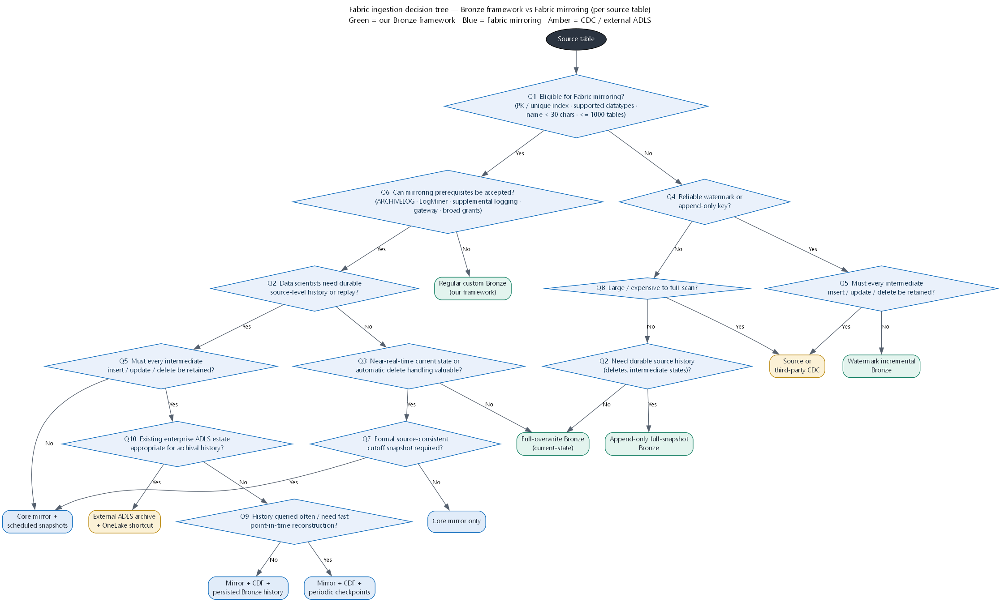

# Fabric Ingestion Decision Guide — Bronze Framework vs Fabric Mirroring

**Purpose.** Decide, **table by table**, whether a source table should be ingested by **our metadata-driven
Bronze framework** or by **Fabric database mirroring** (and which variant of each), so that data
scientists get both *current source-aligned data* and *durable source-level history* at a defensible
cost on a reserved **F64** capacity.

**Verification date:** 2026-07-28. Product limits and cost *rules* are cited from official Microsoft
documentation (see §21). Where Microsoft publishes no machine-readable dollar figure, this guide inserts
`VERIFY CURRENT MICROSOFT PRICE` and names the page to check. All illustrative numbers are labelled as such.

---

## 1. Executive recommendation

There is **no single winner**. The two approaches solve different problems:

- **Fabric mirroring** is primarily a **managed current-state replica**. It excels at near-real-time
  current data, automatic insert/update/delete handling, and *free* replication compute + a large *free*
  storage allowance on F64. It does **not**, by itself, give you convenient permanent row-level history.
- **Our Bronze framework** gives you **explicit control of historical fidelity** — append-only snapshots,
  watermark increments, soft-delete reconciliation, DQ/masking before landing, and custom source queries —
  at the cost of engineering effort and source-scan load.

**Recommended default for BC Pension Corporation:** a **hybrid**.

1. **Mirror** the eligible, well-behaved tables for a live `bronze_current`.
2. Where data scientists need durable history, **persist Delta Change Data Feed (CDF)** from the mirror into
   an **append-only `bronze_history`** table that *we* own and manage.
3. Add **`bronze_snapshot`** checkpoints (weekly / monthly / business-close) for fast point-in-time
   reconstruction and formal cutoffs.
4. Build **Gold SCD2** as curated *business* history on top — **not** as the raw historical layer.

For tables that are **ineligible for mirroring** (no PK/unique index, unsupported datatypes, long names,
views, unacceptable prerequisites) or that are **small / delete-heavy / watermark-less**, use the
**Bronze framework** variant chosen by the decision tree in §6.

> **One-line rule.** *Pipeline frequency controls latency; the ingestion method controls historical
> fidelity.* Choose the method by the history you must keep, then tune the schedule for the latency you need.

---

## 2. Scope and assumptions

- Microsoft Fabric is the target analytics platform, on a **continuously running, reserved F64 capacity**.
- **Oracle** is the primary source example; **SQL Server, Azure SQL Database, Azure SQL Managed Instance**
  and other Fabric-supported mirror sources are also in scope (see §21 for the current supported list).
- Gold **dimensions** generally use **SCD Type 2**. Facts do **not** automatically use SCD2.
- Data scientists need **both**: (a) direct access to **current** source-aligned data, and (b) **durable
  source-level history**, including **deleted records and intermediate states**.
- Some source tables have **no reliable watermark** (`ModifiedDate` / `ModifiedBy` / version column).
- Tables vary: small, append-only, mutable, delete-heavy, view-based, or incompatible with mirroring.
- **Source-system impact, Fabric compute usage, and storage cost all matter.**
- **Gold SCD2 must not be treated as the only raw historical layer.**

---

## 3. Why Gold SCD2 is not enough

Gold SCD2 is **curated business history**, not raw source history. It is a *lossy, opinionated* projection:

- **SCD2 can preserve only the changes exposed by its input.** If the input is a **daily snapshot** or a
  **daily read of a mirrored current-state table**, SCD2 sees at most **one state per key per day** and
  **silently loses every intraday intermediate state**. Two updates and a correction between two daily
  reads collapse into a single new version (or none).
- **Only business-significant fields should normally trigger a Type 2 version.** SCD2 deliberately ignores
  operational churn (e.g. a `last_login` bump), so it is *not* a faithful record of what the source did.
- **Deletes** are modelled as an end-date/soft-delete flag by business rule, not as the raw physical delete
  event with its original values and timestamp.
- **Facts** are usually append/upsert, not SCD2 — so SCD2 is not even the history mechanism for most rows.

Data-science replay, deleted-record investigation, regulatory evidence, and point-in-time ML training all
need the **raw** history that SCD2 discards. Hence the dedicated **`bronze_history`** layer below.

> **CDF-based Gold can contain more versions than snapshot-based Gold**, because CDF captures *every retained
> real source change* while a daily snapshot captures at most one state per day. Same SCD2 logic, richer input.

---

## 4. Target architecture

The recommended pattern for **high-value, mirror-eligible** tables that need durable history:

```text
Source database
      |
      v
Fabric mirrored current-state database        (managed replica; near-real-time; deletes applied)
      |
      +-------------------------------+
      |                               |
      v                               v
Lakehouse shortcut              Mirrored Delta CDF
for current source data         (retained inserts / update images / deletes)
   = bronze_current                    |
                                       v
                              Persisted append-only
                              Bronze change history          = bronze_history
                                       |
                      +----------------+----------------+
                      |                                 |
                      v                                 v
          Periodic snapshot checkpoints          Gold SCD Type 2
             = bronze_snapshot                      = gold
```

- **`bronze_current`** — a **read-only OneLake shortcut** to the current mirrored source table. No copy;
  no ETL; always the live current state.
- **`bronze_history`** — a **durable, append-only** table that *we* own, built by **persisting CDF** from the
  mirror. This is the raw history SCD2 does not keep.
- **`bronze_snapshot`** — optional **weekly / monthly / business-close checkpoints**, for fast point-in-time
  reconstruction and formal source-consistent cutoffs.
- **`gold`** — governed **SCD2** dimensions (and non-SCD2 facts): curated *business* history.

For **ineligible or ill-suited** tables, `bronze_current` / `bronze_history` / `bronze_snapshot` are produced
instead by the **Bronze framework** (full-overwrite, watermark-incremental, or append-only full-snapshot).
The *logical layers are the same*; only the *producer* differs.

> **CDF operational caveat (verify in your tenant).** Delta CDF is a table property
> (`delta.enableChangeDataFeed`). Whether it can be enabled directly on the **mirror-managed** Delta table, or
> whether `bronze_history` must be built by reading the mirror's **Delta version diffs / incremental commits**
> into a Bronze Delta table that *we* mark CDF-enabled, should be confirmed against current Fabric behavior.
> The *layer contract* is identical either way. See §17.

---

## 5. Bronze data-product definitions

| Layer | Definition | Producer(s) | Consumers | Key property |
|---|---|---|---|---|
| **`bronze_current`** | Current source-aligned state, 1:1 with the source table | Mirror shortcut, **or** full-overwrite / watermark Bronze | Data scientists (current features), Silver | Current only; no history |
| **`bronze_history`** | Durable append-only record of every **retained** insert / update-image / delete | Persisted **CDF**, **or** append-only full-snapshot Bronze | Replay, deleted-record investigation, PIT ML training | Immutable; the raw history |
| **`bronze_snapshot`** | Source-consistent checkpoints at weekly / monthly / business-close cadence | Scheduled snapshot job | Fast PIT reconstruction, formal cutoffs, month-end | Bounded, cheap to read at a point |
| **`gold`** | Governed **SCD2** dimensions + facts | Silver → Gold builders | Dimensional reporting, governed analytics | Curated **business** history, not raw |

**Gold SCD2 is curated business history and does not replace raw source history.** `bronze_history` is the
system of record for "what the source actually did"; Gold is "what the business chose to version."

---

## 6. Decision tree

Render source: [`fabric_ingestion_decision_tree.dot`](fabric_ingestion_decision_tree.dot) — generated with
Graphviz (`dot`), top-to-bottom, with Yes/No branch labels. PNG and SVG are checked into this folder.



**Terminal recommendations** (colour-coded: green = our Bronze framework, blue = Fabric mirroring, amber =
CDC / external ADLS):

1. **Regular custom Bronze** — mirror-eligible but prerequisites unacceptable; use the framework's connector.
2. **Watermark incremental Bronze** — reliable watermark, no need to retain every intermediate change.
3. **Full-overwrite Bronze** — current-state only; small / cheap; no durable history required.
4. **Append-only full-snapshot Bronze** — no watermark, durable history required, small enough to full-scan.
5. **Core mirror only** — eligible, prerequisites OK, no durable history need, no formal cutoff.
6. **Core mirror + scheduled snapshots** — as above plus daily/periodic history or a formal cutoff.
7. **Mirror + CDF + persisted Bronze history** — durable, every-change history; history queried occasionally.
8. **Mirror + CDF + periodic checkpoints** — durable every-change history queried often / fast PIT needed.
9. **Source or third-party CDC** — must retain every change but table can't mirror and has no usable watermark
   (or is too large to full-scan).
10. **External ADLS archive + OneLake shortcut** — durable history that is large, rarely queried, or belongs in
    an existing enterprise lake / lifecycle-managed archive.

---

## 7. Plain-language decision sequence

1. **Is the table eligible for Fabric mirroring?** (PK **or** unique index; supported datatypes; name < 30
   chars; within the 1000-table limit; a supported source.) — *No →* it's a **framework** table; skip to step 8.
2. **Can the mirroring prerequisites be accepted?** (Oracle: ARCHIVELOG, LogMiner, supplemental logging,
   on-prem data gateway, broad grants incl. `SELECT ANY TABLE`; read-write source.) — *No →* **Regular custom
   Bronze**.
3. **Do data scientists need durable source-level history or replay?** — *No →* step 4. *Yes →* step 5.
4. **Is near-real-time / automatic delete handling valuable?** — *No →* **Full-overwrite Bronze** (mirroring
   isn't worth it). *Yes →* **Core mirror only**, or **Core mirror + scheduled snapshots** if a formal cutoff
   is required.
5. **Must every intermediate insert/update/delete be retained?** — *No →* **Core mirror + scheduled snapshots**
   (daily resolution is enough). *Yes →* step 6.
6. **Is an existing enterprise ADLS estate appropriate for this history?** — *Yes →* **External ADLS archive +
   OneLake shortcut**. *No →* step 7.
7. **Is the history queried often / do you need fast point-in-time reconstruction?** — *Yes →* **Mirror + CDF +
   periodic checkpoints**. *No →* **Mirror + CDF + persisted Bronze history**.
8. **(Framework path) Is there a reliable watermark or append-only key?** — *Yes →* if every change must be
   retained, **Source/third-party CDC**; else **Watermark incremental Bronze**. *No →* step 9.
9. **Is the table large / expensive to full-scan?** — *Yes →* **Source/third-party CDC**. *No →* if durable
   history is required, **Append-only full-snapshot Bronze**; else **Full-overwrite Bronze**.

---

## 8. Functional comparison

Cells: **Y** = yes / native, **N** = no, **~** = partial / with effort, **—** = not applicable.
Method codes: **FO** full-overwrite Bronze · **WM** watermark-incremental Bronze · **FS** append-only
full-snapshot Bronze · **MC** core mirror · **MS** mirror + scheduled snapshots · **CDF** mirror + persisted
CDF history · **CDK** mirror + CDF + checkpoints · **ADLS** external ADLS + shortcut · **CDC** source/3rd-party CDC.

| Capability | FO | WM | FS | MC | MS | CDF | CDK | ADLS | CDC |
|---|---|---|---|---|---|---|---|---|---|
| Current-state access | Y | ~ | ~ | Y | Y | Y | Y | ~ | ~ |
| Durable raw history | N | ~ | Y | N | ~ | Y | Y | Y | Y |
| Intraday state capture | N | ~ | N | ~ | N | Y | Y | Y | Y |
| Inserts | Y | Y | Y | Y | Y | Y | Y | Y | Y |
| Updates | Y | Y | Y | Y | Y | Y | Y | Y | Y |
| Hard deletes | ~ | N | ~ | Y | Y | Y | Y | Y | Y |
| Point-in-time reconstruction | N | ~ | ~ | N | ~ | Y | Y | Y | Y |
| Low source-scan impact | N | Y | N | Y | Y | Y | Y | Y | Y |
| Watermark required | N | Y | N | N | N | N | N | N | N |
| Custom source queries | Y | Y | Y | N | N | N | N | ~ | ~ |
| Pre-landing transformations | Y | Y | Y | N | N | ~ | ~ | ~ | ~ |
| Bronze writability (we own it) | Y | Y | Y | N | ~ | Y | Y | Y | Y |
| Manual optimization (OPTIMIZE/Z-order) | Y | Y | Y | N | ~ | Y | Y | Y | Y |
| Schema-change flexibility | Y | Y | Y | ~ | ~ | ~ | ~ | Y | ~ |
| Replay capability | N | ~ | Y | N | ~ | Y | Y | Y | Y |
| Gold SCD2 fidelity | Low | Med | Med | Low | Med | **High** | **High** | High | High |

**Reading it:** mirroring wins on *current state, deletes, and low source impact*; the framework wins on
*custom queries, pre-landing transforms, and writability*; only **CDF-based** patterns (or full CDC) give
**high Gold SCD2 fidelity** with durable, intraday, replayable history.

---

## 9. Business-requirement comparison

| Business requirement | Recommended method(s) |
|---|---|
| End-of-day state only | Core mirror + daily snapshot, **or** daily full-overwrite / watermark Bronze |
| Near-real-time state | **Core mirror** (`bronze_current` shortcut) |
| Every intermediate state | **Mirror + CDF + persisted history**, or source/3rd-party CDC |
| Deleted-record investigation | **Mirror + CDF** (delete images) or append-only snapshot diff; mirror-only loses them after retention |
| Formal month-end snapshot | **`bronze_snapshot`** checkpoint (mirror + scheduled snapshot, or snapshot Bronze) |
| Regulatory evidence | Persisted **CDF history** + checkpoints (immutable, replayable), optionally ADLS WORM archive |
| Data-science feature engineering | `bronze_current` (features) + `bronze_history` (labels/lookbacks) |
| Point-in-time ML training data | **Checkpoint + CDF replay** to reconstruct as-of state |
| Gold dimensional reporting | **Gold SCD2** over Silver |
| Lowest engineering effort | **Core mirror** (turnkey) |
| Lowest source-system impact | **Core mirror** (log-based) or watermark incremental |
| Lowest storage cost | **Core mirror** current-state (free under F64 allowance) — but no durable history |
| Custom transformation at ingest | **Bronze framework** (`filters`/`select`/cleanse/mask) |
| Legal-grade auditing | Persisted CDF history + immutable checkpoints + audit lineage |

---

## 10. Source-table comparison

| Source-table trait | Recommended method |
|---|---|
| Small reference table | Full-overwrite Bronze, or core mirror if already mirroring |
| Large mutable table | **Core mirror** (avoid repeated full scans); add CDF if history needed |
| No watermark | Mirror (if eligible) **or** append-only full-snapshot / CDC — *not* watermark incremental |
| Reliable watermark | Watermark incremental Bronze (or mirror) |
| Append-only table | Watermark incremental Bronze (cheapest); mirror also fine |
| Frequent updates | **Mirror** (log-based, low source impact); **+ CDF** to keep the update images |
| Frequent deletes | **Mirror** (applies deletes) **+ CDF** (retains the delete rows) |
| Intraday transitions | **Mirror + CDF** (daily snapshots/reads miss them) |
| No PK or unique index | **Not mirrorable** → framework Bronze (row-hash dedup / snapshot) |
| Unsupported Oracle datatype (LOB/XML/…) | **Not mirrorable** → framework Bronze with `select`/casts |
| Long Oracle table name (≥ 30 chars) | **Not mirrorable** → framework Bronze |
| Oracle **view** | **Not a mirror object** → framework Bronze (custom query) |
| Partitioned table | Mirror **supported**; framework also fine |
| Frequent datatype changes | **Framework Bronze** (schema-on-read tolerates; mirror rejects type changes) |
| Custom joins or casts at ingest | **Framework Bronze** (`select` / SparkSQL) — mirror is 1:1 only |
| Supplemental logging unavailable | **Not mirrorable** → framework Bronze |
| Formal business-cutoff requirement | Add **`bronze_snapshot`** checkpoints regardless of producer |

---

## 11. Data-science access patterns

| Question the user is asking | Query this layer |
|---|---|
| "What is the value **now**?" | **`bronze_current`** (mirror shortcut / current Bronze) |
| "What was the **full change history** of this key, including deletes and intermediate states?" | **`bronze_history`** (persisted CDF) |
| "What did the source look like at a **specific past checkpoint** (month-end / business close)?" | **`bronze_snapshot`** |
| "As-of an **arbitrary** past instant" | Nearest **`bronze_snapshot`** + replay **`bronze_history`** changes since |
| "Governed **business** dimension with effective dates" | **`gold`** SCD2 |

Guidance to publish to data scientists: *current features* from `bronze_current`; *labels, look-backs and
event sequences* from `bronze_history`; *point-in-time training sets* from `bronze_snapshot` + CDF replay;
*reporting* from `gold`. Never use Gold SCD2 as the raw event source.

---

## 12. Cost model

Separate the cost drivers. On a **reserved F64**, compute you *don't* spend is not refunded — so
**capacity contention / opportunity cost** is real even when a line item is "free."

| # | Cost driver | Treatment (verified rule) |
|---|---|---|
| 1 | Reserved F64 compute commitment | Fixed monthly reservation; discounts matching compute. **Currency/amount: `VERIFY CURRENT MICROSOFT PRICE`** — Fabric pricing page. |
| 2 | Capacity contention / opportunity cost | Real: mirror **query** compute, CDF reads, snapshot jobs, and Gold builds all draw from the same F64 CU pool. |
| 3 | Core mirroring compute | **Free** — background replication does **not** consume capacity. [mirroring/overview] |
| 4 | CDF extended-capability compute | Reading/persisting CDF is normal **Spark/SQL compute** → consumes CU at regular rates. |
| 5 | Pipeline / Copy Job compute | Data Factory in Fabric consumes CU (Copy/pipeline rates). **`VERIFY CURRENT MICROSOFT PRICE`** — Fabric pricing page. |
| 6 | Gold SCD2 processing compute | Normal Spark/SQL CU for the SCD2 merge. |
| 7 | Mirrored storage | **Free up to 1 TB per CU** (F64 = 64 TB), exclusive to mirroring; **over-limit or paused → OneLake rates**. [mirroring/overview] |
| 8 | Regular OneLake Bronze storage | Pay-as-you-go per GB; **does not consume CU**; billed separately. [onelake-consumption] |
| 9 | Persisted CDF-history storage | **Normal OneLake storage** (it is *our* table, **not** mirrored-replica data → **not** covered by the mirror allowance). |
| 10 | Snapshot-checkpoint storage | Normal OneLake storage (our tables). |
| 11 | Gold SCD2 storage | Normal OneLake storage. |
| 12 | External ADLS storage | Azure ADLS Gen2 rates (Hot/Cool/Archive); billed by ADLS, **not** OneLake. |
| 13 | ADLS transactions / retrieval / networking | ADLS operation + retrieval + egress charges; **OneLake does not meter external-shortcut requests** (ADLS bills you directly). [onelake-consumption] |
| 14 | Gateway infrastructure | On-prem data gateway VM(s) — **not** covered by the F64 reservation; you run/patch/HA them. |
| 15 | Oracle redo / archive-log / supplemental-logging / LogMiner overhead | Extra I/O, storage and CPU **on the source Oracle system** (a DBA-owned cost, external to Fabric). |

**What the F64 reservation covers vs not.** The reservation discounts **matching Fabric compute** only. It
does **not** generally include **ordinary OneLake storage**, **ADLS storage**, **networking/egress**, or
**gateway infrastructure**. Mirrored-replica storage is separately free up to the per-CU allowance.

**Verified cost rules used above (official Microsoft docs, verified 2026-07-28):**

- *Mirroring:* "Storage for replicas is free up to a limit based on the capacity size. Mirroring offers a
  **free terabyte of mirroring storage for every capacity unit** … an **F64** capacity … **64 free terabytes**
  … You pay for OneLake storage if you exceed the free mirroring storage limit **or when the capacity is
  paused**." "Background Fabric compute used to replicate … is **free and doesn't consume capacity**. …
  querying data by using SQL, Power BI, or Spark is charged at regular rates." — [mirroring/overview]
- *OneLake:* "OneLake storage is billed at a **pay-as-you-go rate per GB** … and **doesn't consume Fabric
  Capacity Units**." "For **native mirrored storage**, OneLake storage isn't billed as it's included…"
  "**Paused capacity**: the data stored continues to be billed using the pay-as-you-go rate per GB."
  "**Cool and cold tiers** introduce a per-GB **data-retrieval fee** … Data Retrieval per GB: **Cool 200
  CU-seconds, Cold 600 CU-seconds**." "**External (ADLS) shortcut** … OneLake does **not** count the CU usage …
  charged directly by the external service." — [onelake-consumption]
- *Delta time-travel is retention-dependent:* mirrored data auto-vacuums; default retention **1 day** (DBs
  created after mid-June 2025) / 7 days (older), configurable. **Do not** rely on time travel for long-term
  history. — [mirroring/overview, "Retention for mirrored data"]

**Pricing-attribution note.** The Fabric **pricing page renders no machine-readable dollar figures** (it shows
placeholders). Therefore every **currency amount** in this guide is `VERIFY CURRENT MICROSOFT PRICE` against
`https://azure.microsoft.com/pricing/details/microsoft-fabric/`. The **CU-second consumption rates** above are
from Microsoft Learn (list/consumption rates, verified 2026-07-28). **Canadian pricing and enterprise
/ EA / CSP discounts may differ**; confirm in the Azure pricing calculator for your agreement and region.

---

## 12a. Cost formulas

Let `S` = current source size, `d` = daily fractional change rate, `R` = retention days, `c` = change-image
factor (pre + post ≈ **2**), `N` = number of snapshots, `g` = Gold current projection fraction, `v` = average
Gold versions per key, `A` = F64 mirrored allowance (= CU × 1 TB = **64 TB**), `M` = total mirrored estate.

- **Full-snapshot storage** ≈ `N × S` (each snapshot is a full copy; compression aside).
- **Incremental / CDF-history storage** ≈ `R × d × S × c` (sum of retained daily change images over the window).
- **Mirrored storage above allowance** = `max(0, M − A)`, billed at OneLake pay-as-you-go per GB.
- **Gold SCD2 storage** ≈ `S × g × v` (current projection times average versions per key).
- **Historical reconstruction (as-of T)** = `nearest bronze_snapshot(≤ T)` **+** `Σ CDF changes in (snapshot, T]`.

**Consequence:** for the same window, `CDF-history (R·d·S·c)` is dramatically smaller than
`daily full snapshots (N·S)` whenever `d·c ≪ 1` — i.e. almost always. And **CDF-based Gold can produce more
versions than snapshot-based Gold** because its input carries every retained real change, not one state per day.

---

## 13. Bronze + Gold cost comparison (qualitative)

| Pattern | Raw-history fidelity | Storage cost | Compute cost | Source impact | Notes |
|---|---|---|---|---|---|
| Daily full snapshots + Gold SCD2 | Daily only (misses intraday) | **Very high** (`N·S`) | High (daily full write) | **High** (daily full scan) | Simple, but storage explodes |
| Core mirror + Gold SCD2 | **None durable** (retention only) | **Lowest** (mirror free) | Low (replication free) | Lowest (log-based) | No raw history — fails DS needs |
| Mirror + persisted CDF + Gold SCD2 | **Full** (every retained change) | Low–moderate (`R·d·S·c`) | Moderate (CDF reads) | Lowest | **Recommended** for history tables |
| Mirror + CDF + checkpoints + Gold SCD2 | Full + fast PIT | Moderate (+ checkpoints) | Moderate–high | Lowest | Fast reconstruction / cutoffs |
| External ADLS history + Gold SCD2 | Full | ADLS rates (cheap cold, + retrieval) | Moderate (+ egress) | Lowest | Best for large, rarely-queried archive |

---

## 14. Worked cost example *(illustrative only — not a customer quote)*

**Assumptions:** current source table **1 TB**; daily change **1 %** (≈ 10 GB/day); retention **90 days**;
Gold current projection **25 %** of source (≈ 250 GB); average Gold versions/key **2.5**; the whole mirrored
estate is **below the confirmed F64 allowance** (so mirrored current-state storage is **free**). Change-image
factor `c = 2`.

| Scenario | `bronze_current` | `bronze_history` / snapshots | Gold SCD2 | **Paid OneLake storage (approx.)** |
|---|---|---|---|---|
| 1. 90 daily full snapshots + Gold SCD2 | (in snapshots) | `90 × 1 TB` = **90 TB** | `1 TB × 0.25 × 2.5` = 0.625 TB | **≈ 90.6 TB** |
| 2. Core mirror + Gold SCD2 | 1 TB **free** | — (only ~1-day time-travel) | 0.625 TB | **≈ 0.6 TB** *(but no durable history)* |
| 3. Mirror + persisted CDF + Gold SCD2 | 1 TB **free** | `90 × 10 GB × 2` ≈ **1.8 TB** | 0.625 TB | **≈ 2.4 TB** |
| 4. Mirror + CDF + monthly checkpoints + Gold SCD2 | 1 TB **free** | CDF ≈ 1.8 TB + `3 × 1 TB` checkpoints = 3 TB | 0.625 TB | **≈ 5.4 TB** |
| 5. External ADLS history + Gold SCD2 | 1 TB **free** | ≈ 1.8 TB in **ADLS** (cool/archive + retrieval) | 0.625 TB (OneLake) | **≈ 0.6 TB OneLake + 1.8 TB ADLS** |

**Takeaways (illustrative):** the **snapshot** approach (#1, ~90 TB) costs roughly **~40×** the storage of the
**CDF** approach (#3, ~2.4 TB) while capturing **less** history (daily vs every retained change). **Mirror-only**
(#2) is cheapest but provides **no durable raw history** and therefore fails the data-science requirement.
**#3 is the recommended default** for history-bearing tables; **#4** buys faster reconstruction; **#5** suits
large, rarely-queried archives. Convert storage TB → dollars via `VERIFY CURRENT MICROSOFT PRICE` (OneLake per-GB)
and the ADLS price list for your region/agreement.

---

## 15. External ADLS Gen2 considerations

Use ADLS Gen2 with **OneLake shortcuts** for history that is **large, rarely queried, cross-platform, or
belongs in an existing enterprise lake** with lifecycle policies (Hot → Cool → Archive, WORM/immutability).

Key truths (verified):

- A **shortcut avoids copying the external bytes** into ordinary OneLake — data stays in ADLS.
- **ADLS storage and transaction charges still apply** (billed by ADLS/Azure Storage, not OneLake).
- **Fabric compute is still consumed** when you *query* shortcut data (Spark/SQL CU on your F64).
- **OneLake does not meter external-shortcut requests** — "OneLake does not count the CU usage for that
  external request … charged directly by the external service such as ADLS." [onelake-consumption]
- **ADLS is not automatically cheaper** than mirrored storage that is **free** under the F64 allowance. ADLS
  wins for history that **does not qualify** for the mirror allowance (CDF history, snapshots) and is cold.
- **Networking, region placement, private endpoints, and retrieval costs matter** — colocate ADLS with the
  Fabric region, use private endpoints, and expect Archive-tier **rehydration latency + retrieval fees**.

Rule of thumb: **hot, current, mirror-eligible → mirror (free allowance)**; **cold, large, rarely-queried
history → ADLS + shortcut**; **warm history queried regularly → persisted CDF in OneLake**.

---

## 16. Oracle requirements and limitations *(verified 2026-07-28 — [oracle-limitations])*

- **Supported versions / environments:** Oracle **10+** with **LogMiner** enabled; on-prem (VM/Azure VM), OCI,
  Oracle Database@Azure, Exadata. **Read-write mode only** — "LogMiner doesn't work on read mode databases"
  (so you **cannot** mirror a read-only physical standby).
- **Key requirement:** table must have a **primary key or a unique index**; without either, **not supported**.
- **Table-name limit:** names **≥ 30 characters** are **not supported**.
- **Table-count limit:** up to **1000 tables** per mirrored database.
- **Partitioned tables:** **supported**.
- **Supported datatypes:** VARCHAR2, NVARCHAR2, NUMBER, FLOAT, DATE, BINARY_FLOAT, BINARY_DOUBLE, RAW, ROWID,
  CHAR, NCHAR, TIMESTAMP WITH LOCAL TIME ZONE, INTERVAL DAY TO SECOND, INTERVAL YEAR TO MONTH.
- **Unsupported datatypes:** anything **not** in that list — e.g. **LOBs (CLOB/BLOB/NCLOB), XMLType, plain
  `TIMESTAMP` / `TIMESTAMP WITH TIME ZONE`, LONG, spatial**. `NUMBER` without precision/scale can fail unless the
  gateway's Oracle client is current.
- **DDL / schema changes:** **add / delete / rename columns** supported (partial); **column data-type updates are
  NOT supported**.
- **Views / other objects:** the limitations page documents **tables**; **views are not a mirrored object type**
  → ingest via the **framework** (custom query). *(Confirm on the source page before relying on this.)*
- **Prerequisites:** **ARCHIVELOG** mode; **supplemental logging** at **database** level and **per table**
  (`ALTER DATABASE ADD SUPPLEMENTAL LOG DATA (PRIMARY KEY, UNIQUE) COLUMNS;` and
  `ALTER TABLE … ADD SUPPLEMENTAL LOG DATA (ALL) COLUMNS;`).
- **Grants (broad):** `CREATE SESSION`, `SELECT_CATALOG_ROLE`, `CONNECT, RESOURCE`, `EXECUTE_CATALOG_ROLE`,
  **`FLASHBACK ANY TABLE`**, **`SELECT ANY DICTIONARY`**, **`SELECT ANY TABLE`**, **`LOGMINING`** — note the
  **instance-wide** `SELECT ANY TABLE` / `SELECT ANY DICTIONARY` (a least-privilege concern for a crown corp).
- **Connectivity:** **On-Premises Data Gateway only** (OPDG **3000.282.5+**); the **VNet data gateway cannot
  serve mirroring**. Keep archive logs ≥ ~24 h during initial load / heavy CDC.

Any table that **fails** these (no PK/unique index, unsupported datatype, ≥ 30-char name, view, supplemental
logging unavailable, prerequisites rejected) is an **automatic framework-Bronze** table.

---

## 17. Operational controls

- **CDF version checkpointing** — persist the last processed Delta commit **version** per table; a CDF consumer
  can run **daily** and still process **every retained change since its last checkpoint**.
- **Idempotent writes** — merge CDF batches on (key, change_version) so re-runs never duplicate history.
- **Advance the checkpoint only after a successful target commit** — never before; crash-safe.
- **CDF / retention alerts** — mirror auto-vacuum + short default retention (1 day) means CDF **must be consumed
  before it vacuums**. Alert if the consumer lags the retention window (else history is lost silently).
- **Source ↔ mirror reconciliation** — periodic row-count / checksum comparison; alert on drift.
- **Initial seed snapshot** — take a `bronze_snapshot` at go-live to anchor reconstruction.
- **Periodic checkpoints** — weekly / monthly / business-close, for fast PIT and formal cutoffs.
- **Delete handling** — mirror applies deletes to `bronze_current`; **CDF retains the delete rows** in
  `bronze_history`. (Framework path: soft-delete reconciliation marks `_is_deleted` / `_deleted_at`.)
- **Update pre-image / post-image** — persist both `update_preimage` and `update_postimage` from CDF so a change
  is fully reconstructable.
- **Stable surrogate keys** — assign durable Gold surrogate keys independent of source churn.
- **Late-arriving facts** — handle out-of-order commits by source event time, not arrival time.
- **Source time vs Fabric commit time** — record both (`_source_ts`, `_commit_ts`); they differ under lag.
- **Schema evolution** — enable Delta schema evolution on `bronze_history`; log drift events; mirror rejects
  **type** changes (fall back to framework for volatile-schema tables).
- **PII protection / RLS / CLS / masking** — apply OneLake security once at the hub; mask/exclude sensitive
  columns **before** they reach data scientists; mirror lands raw, so govern downstream deliberately.
- **Data-science access controls** — publish `bronze_current` / `bronze_history` / `bronze_snapshot` via
  least-privilege groups; never expose raw PII history ungoverned.
- **Mirrored-footprint monitoring** — watch the mirrored estate vs the **64 TB** F64 allowance (over-limit → paid).
- **F64 CU monitoring** — Capacity Metrics app; watch contention from CDF reads, snapshot jobs, Gold builds.
- **Gateway monitoring** — OPDG health, version, throughput; dedicate VM(s), cluster for HA.
- **Replay & disaster recovery** — reconstruct any as-of state from `bronze_snapshot` + CDF; document RPO/RTO;
  consider BCDR geo-replication (billed as BCDR storage).

---

## 18. Recommended implementation by table group

| Table group | Method | Layers produced |
|---|---|---|
| **Core dimensions** (mirror-eligible, PK, need history) | **Mirror + CDF + periodic checkpoints** | current + history + snapshot → Gold SCD2 |
| **High-churn / delete-heavy dimensions** | **Mirror + CDF + persisted history** | current + history → Gold SCD2 (with delete images) |
| **Facts** (append/upsert, mirror-eligible) | **Core mirror** (+ CDF if event history needed) | current (+ history) → Gold facts (**not** SCD2) |
| **Small reference tables** | **Full-overwrite Bronze** (or core mirror if trivial) | current → Gold |
| **Watermarked, append-only tables** | **Watermark incremental Bronze** | current + history |
| **No PK / unsupported datatype / view / long name** | **Framework Bronze** (snapshot or overwrite) | current (+ snapshot history) |
| **Prerequisites unacceptable** | **Regular custom Bronze** | current (+ history) |
| **Large, cold, rarely-queried history** | **External ADLS + OneLake shortcut** | archived history |
| **Formal month-end / regulatory cutoff (any table)** | Add **`bronze_snapshot`** checkpoints | + snapshot |

---

## 19. Risks and trade-offs

- **CDF must be consumed before mirror auto-vacuum** (default 1-day retention). *Mitigation:* run the CDF
  consumer at least daily; alert on lag; extend `retentionInDays` as a safety margin (raises mirror storage).
- **CDF availability on the mirror-managed table is not guaranteed** — may require capturing Delta version diffs
  into a Bronze table we own. *Mitigation:* verify in-tenant; the `bronze_history` contract is unchanged.
- **Mirror is 1:1** — no pre-landing masking/subsetting; **raw PII lands** in OneLake. *Mitigation:* govern with
  OneLake security downstream, or use framework Bronze for the most sensitive tables.
- **Broad Oracle grants** (`SELECT ANY TABLE`, `SELECT ANY DICTIONARY`) — least-privilege concern.
- **Mirror can't use a read-only standby** — capture runs against the primary (source load).
- **Over-allowance / paused-capacity storage** becomes billable; snapshots and CDF history are **not** covered by
  the mirror allowance (they're our tables). *Mitigation:* monitor footprint; tier cold history to ADLS.
- **Daily snapshot / daily mirror read loses intraday states** — if intraday fidelity is required, CDF (or CDC)
  is mandatory.
- **Facts as SCD2** would explode storage and mislead — keep facts append/upsert.

---

## 20. Final recommendation

- **Default to a hybrid.** Mirror eligible, well-behaved tables for `bronze_current`; **persist CDF** into
  `bronze_history`; add `bronze_snapshot` checkpoints; build **Gold SCD2** as *business* history.
- **Use the framework** for tables that can't or shouldn't mirror (no PK, unsupported datatype, view, long name,
  supplemental logging unavailable, prerequisites rejected, or heavy pre-landing transforms).
- **Treat `bronze_history` — not Gold SCD2 — as the system of record for raw source history**, including
  deletes and intermediate states.
- **Right-size by history need, then schedule for latency.** Pipeline frequency is a dial for latency; the
  chosen method fixes the historical fidelity ceiling.
- **Watch the F64 allowance and CU contention.** Mirroring's free replica storage is generous (64 TB) but CDF
  history, snapshots, and Gold are ordinary OneLake storage; queries and CDF reads spend real CU.

Apply the **decision tree (§6)** per table; group by §18; validate against §16 eligibility before mirroring.

---

## 21. Official Microsoft references

- Mirroring overview (cost of mirroring, retention, replication): https://learn.microsoft.com/en-us/fabric/mirroring/overview
- OneLake consumption (storage billing, tiers, retrieval, shortcuts, paused capacity): https://learn.microsoft.com/en-us/fabric/onelake/onelake-consumption
- Fabric pricing (dollar figures — **verify**): https://azure.microsoft.com/en-us/pricing/details/microsoft-fabric/
- Mirror Oracle databases: https://learn.microsoft.com/en-us/fabric/mirroring/oracle
- Oracle mirroring limitations: https://learn.microsoft.com/en-us/fabric/mirroring/oracle-limitations
- Oracle mirroring tutorial (prereqs / gateway): https://learn.microsoft.com/en-us/fabric/mirroring/oracle-tutorial
- CI/CD for mirrored databases: https://learn.microsoft.com/en-us/fabric/mirroring/mirrored-database-cicd
- OneLake shortcuts: https://learn.microsoft.com/en-us/fabric/onelake/onelake-shortcuts
- OneLake security (RLS/CLS): https://learn.microsoft.com/en-us/fabric/onelake/security/data-access-control-model
- Delta Lake Change Data Feed (concept): https://learn.microsoft.com/en-us/azure/databricks/delta/delta-change-data-feed

---

## 22. Verification notes

**Verified from official Microsoft docs (2026-07-28):**

- F64 mirroring free storage = **1 TB per CU → 64 TB**, capacity-wide, exclusive to mirrored replicas; over-limit
  **or paused** → OneLake pay-as-you-go rates. [mirroring/overview, ms.date 2026-07-17]
- Mirroring **replication compute is free**; SQL/PBI/Spark **queries** charged at regular CU rates. [same]
- Mirror **retention** default **1 day** (DBs after mid-June 2025) / 7 days (older), auto-vacuum, configurable →
  **time travel is retention-dependent**, not a long-term history strategy. [same]
- OneLake storage **pay-as-you-go per GB, does not consume CU**; **native mirrored storage not billed**;
  **paused capacity** still billed for storage. [onelake-consumption, ms.date 2026-05-20]
- OneLake **Cool/Cold data-retrieval** = **200 / 600 CU-seconds per GB**; read CU-second rates Hot **104** /
  Cool **260** / Cold **2,600** per (4 MB, per 10,000). [onelake-consumption]
- **External-shortcut (ADLS) requests are not metered by OneLake** — billed by ADLS directly. [onelake-consumption]
- Full **Oracle** eligibility, datatype, DDL, grant, and gateway limits. [oracle-limitations, ms.date 2026-02-26]

**Could NOT verify machine-readable dollar values — use `VERIFY CURRENT MICROSOFT PRICE`:**

- OneLake storage **$/GB-month** (Hot/Cool/Cold) — the Fabric pricing page renders placeholders ("$-").
- F64 **pay-as-you-go $/hour** and **1-year reservation $/month**.
- Fabric **Copy Job / pipeline $ per CU** (dollar conversion).
- ADLS Gen2 **$/GB** (Hot/Cool/Archive) + transaction/retrieval/egress — see the Azure Storage pricing page.
- → Check `https://azure.microsoft.com/en-us/pricing/details/microsoft-fabric/` and the Azure pricing calculator.

**Currency / list-pricing note.** CU-second consumption rates above are Microsoft Learn **list/consumption**
rates (not currency), verified 2026-07-28. All **dollar** figures are **USD list** placeholders to be verified;
**Canadian pricing and enterprise / EA / CSP discounts may differ** — confirm for your region and agreement.

**Chart provenance.** The decision tree is generated with **Graphviz** (`dot` v15.1.0) from
`fabric_ingestion_decision_tree.dot`; PNG and SVG are in this folder. **No Mermaid source is used as the chart.**
</content>
