# BC Pension Corporation — Fabric Delivery Guide

**What this is.** A plain-language companion to the milestone plan. For every item in the three
milestones it answers two questions: **what it means in Microsoft Fabric** (concept, not deep tech)
and **how we control it** — either because our Fabric **platform** already handles it, or because we
recommend a **standard** for BCPC to adopt.

**Audience.** Anyone with a working familiarity of Fabric. We stay at the "what and how we manage
it" level and avoid implementation detail.

**How to read each item.** Every item below carries one tag:

- **Platform** — already implemented in our Fabric control plane (our config-as-code framework does it).
- **Standard** — a governance/operating standard we recommend BCPC adopt (a policy or decision, not code).
- **Both** — the platform provides the mechanism; a standard sets the policy on top of it.

> Our **control plane** is the config-as-code framework we built on Fabric: you declare *what* to
> load and *how* to govern it as configuration, and the framework connects, ingests, cleanses,
> quality-checks, models, and secures the data across DEV / UAT / PROD. Wherever an item says
> **Platform**, this is what's doing the work.

### The three milestones at a glance

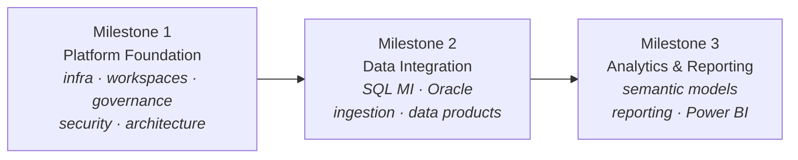

*Foundation first (the platform everything runs on), then get data in and managed, then turn it
into governed analytics.*

---

## Milestone 1 — Fabric Platform Foundation

**Goal:** stand up the infrastructure, governance, security, architecture, and operating framework
that everything else runs on.

### How the platform fits together

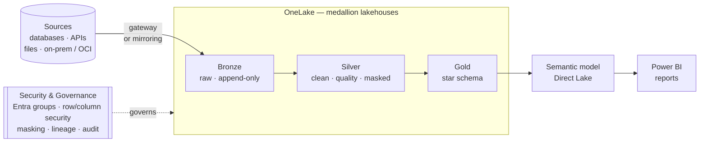

*Everything sits on a **Capacity**, is organized into **Workspaces / Domains**, and flows through
the **medallion** to reports — with **security and governance** applied across every layer. The
items below are the pieces of this picture.*

> The recommended **workspace shape** — a central **hub** that loads the data, with domain **spokes**
> that shortcut to it — is set out in the **[Platform Topology — Hub & Spoke](#platform-topology--hub--spoke)**
> section, along with the security model behind it.

### Establish Fabric Infrastructure Foundation

*The physical footing: the compute we buy, the network path to our data, and the replication options.*

| Item | What it means in Fabric | How we control it |
|---|---|---|
| **Provision Fabric Capacity** | The compute + storage tier (an F-SKU) that powers every workspace, pipeline, and report in the tenant. | **Standard.** Size an F-SKU to the workload and assign it to the project workspaces; our provisioning script then stands up everything that runs on it, identically per environment. |
| **Configure Capacity Administration** | The admin controls for that capacity — who manages it, feature switches, workload limits, surge protection. | **Standard.** A named capacity-admin group manages it in the Admin portal; we recommend surge-protection and throttling guardrails so one workload can't starve others. |
| **Deploy Fabric Data Gateway** | Software that lets Fabric reach data behind a private network (on-prem or private OCI/Azure). | **Both.** Our ingestion routes private sources through the gateway; we've documented the gateway architecture, including reusing the **existing VNet gateway** vs standing up a dedicated one. |
| **Validate Gateway Connectivity** | Confirming Fabric can actually reach a source through the gateway. | **Standard.** A "test connection" per source before onboarding, plus a documented checklist (firewall, DNS, service account). |
| **Review Gateway Architecture** | Choosing gateway type and network path (VNet data gateway vs on-premises data gateway). | **Platform.** We produced the private-OCI architecture diagrams — the framework path reusing the VNet gateway, and the mirroring path requiring a dedicated on-prem gateway. |
| **Validate SQL MI Mirroring Architecture** | Confirming near-real-time mirroring works for Azure SQL Managed Instance. | **Both.** Mirroring is Microsoft-managed; we've mapped how a mirrored database feeds our Silver/Gold and recommend it for specific near-real-time tables. |
| **Assess Oracle Mirroring Feasibility** | Whether Oracle mirroring fits BCPC (prerequisites, limits, cost, promotion). | **Platform.** Delivered as our *Bronze vs Mirroring* analysis — GA status, the invasive prerequisites, coverage limits, gateway needs, and a clear recommendation. |
| **Document Infrastructure Architecture** | A written, shared picture of the platform's infrastructure. | **Platform.** The architecture diagrams and this guide are that documentation, kept in the repo alongside the code. |

### Establish Fabric Platform Foundation

*The logical structure: workspaces, domains, and the lakehouses where data lives — plus the reusable patterns that make new work fast.*

| Item | What it means in Fabric | How we control it |
|---|---|---|
| **Create Initial Fabric Workspaces** | Workspaces are the containers that hold items (lakehouses, pipelines, reports) and carry access + capacity. | **Platform.** Our provisioning script creates the workspaces per environment; nothing is hand-clicked. |
| **Define Workspace Structure** | How you divide work into workspaces (by environment, domain, project, or product). | **Standard.** We recommend an environment split (DEV / UAT / PROD) with domain-aligned workspaces inside, so promotion and access stay clean. |
| **Define Domain Alignment Strategy** | Fabric **domains** group workspaces by business area for ownership and discovery. | **Standard.** Map domains to BCPC business areas (e.g. Pensions, Employer, Member) so ownership and data discovery follow the org. |
| **Create Initial Lakehouses** | Lakehouses are the storage+table layer in OneLake where data lands and is modelled. | **Platform.** The framework creates the schema-enabled lakehouses (metadata, bronze, silver, gold, file-drop) as declared config. |
| **Define Lakehouse Organization Standards** | Naming and layout of lakehouses, schemas, and tables. | **Platform.** Enforced by convention: schema-enabled lakehouses, medallion layers, and a single naming rule (`schema.table`), all driven from config. |
| **Implement Public Dataset Reference Solution** | A pattern for bringing external/open reference data into the platform. | **Platform.** Demonstrated end-to-end with a Statistics Canada open-data feed loaded through our generic HTTP connector to Silver. |
| **Validate Auto-Ingestion Framework** | Proving that data can be onboarded by configuration rather than bespoke code. | **Platform.** This is the core of the control plane — plus an event-driven "drop a file, it loads itself" intake — validated on real data. |
| **Establish Reusable Platform Patterns** | Turning one-off solutions into repeatable building blocks. | **Platform.** One registry of connectors, config-as-code onboarding, and a packaged engine mean a new source is *configuration*, not new code. |

### Define Fabric Platform Governance

*Who runs the platform and by what process — ownership, capacity, onboarding, and endorsement.*

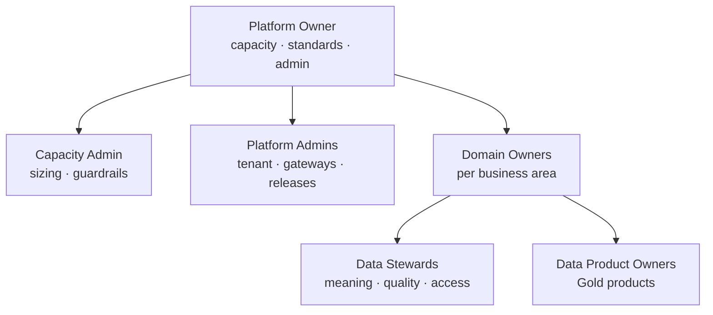

*The operating model in one picture: a central **Platform Owner** sets standards and runs capacity;
**Domain Owners** own their business area's data, supported by **Stewards** and **Data Product
Owners**.*

| Item | What it means in Fabric | How we control it |
|---|---|---|
| **Define Platform Ownership Model** | Who owns the Fabric platform overall (the "landlord" of capacity, admin settings, standards). | **Standard.** A platform-owner role (small central team) accountable for capacity, tenant/admin settings, and the standards in this guide. |
| **Define Workspace Creation Process** | How new workspaces get requested, approved, and created consistently. | **Both.** A request→approve step feeding our provisioning script, so every workspace is created to standard (naming, access, capacity) rather than ad hoc. |
| **Define Workspace Ownership Standards** | Who owns each workspace and is accountable for its contents. | **Standard.** Each workspace has a named owner (domain-aligned) responsible for access reviews and its data products. |
| **Define Capacity Governance Process** | How capacity is monitored, allocated, and protected from overload. | **Standard.** Monitor via the Capacity Metrics app; set throttling/surge guardrails; a defined path to scale or rebalance workloads. |
| **Define Platform Administration Responsibilities** | The concrete duties of the admins (tenant settings, gateways, updates, incidents). | **Standard.** A responsibilities matrix (RACI) covering tenant settings, gateway upkeep, capacity, and release management. |
| **Define Monitoring and Support Model** | How platform health and issues are watched and resolved. | **Both.** Fabric monitoring + our run/audit logs feed a defined support model (who watches what, escalation path). |
| **Define Onboarding Process** | The repeatable path for a new team, source, or data product to join the platform. | **Both.** A checklist that ends in config-as-code entries + our discovery step, so onboarding a source is guided and consistent. |
| **Define Endorsement and Certification Process** | Fabric's **Promoted / Certified** labels that signal trustworthy, official items. | **Standard.** Define who can certify, the criteria (owner, quality, documentation), and reserve "Certified" for governed Gold data products. |

### Define Fabric Data Governance Framework

*Who owns the data and how its quality, meaning, lineage, and lifecycle are managed.*

| Item | What it means in Fabric | How we control it |
|---|---|---|
| **Define Data Domain Ownership Model** | Which business area owns which data. | **Standard.** Data domains map to business areas with a named domain owner accountable for the data within. |
| **Define Data Steward Responsibilities** | The people who curate meaning, quality, and access for a data area. | **Standard.** A steward role per domain — owns definitions, quality rules, and access decisions for their data. |
| **Define Data Product Ownership Model** | Treating governed datasets as "products" with an owner and consumers. | **Standard.** Gold outputs are the data products; each has an owner, a documented purpose, and a consumer contract. |
| **Define Metadata Management Approach** | How we capture what data exists, its schema, and its meaning. | **Both.** The platform captures technical metadata (sources, schemas, drift, run history) in config + audit tables; the OneLake catalog + a business glossary standard add business meaning. |
| **Define Data Quality Standards** | The rules that decide whether data is fit to use. | **Platform.** Declarative quality rules (not-null, ranges, allowed values, expressions) run on the way to Silver, with failing rows quarantined off the clean layer. |
| **Define Data Lineage Requirements** | Being able to trace where data came from and what it feeds. | **Both.** Fabric's built-in lineage view across items, plus our audit tables that record every source→bronze→silver→gold run. |
| **Define Data Lifecycle Standards** | Retention, history, and archival of data over time. | **Both.** Bronze is an append-only history (audit trail); Silver/Gold hold current + modelled history (slowly-changing dimensions); a retention standard sets how long each is kept. |
| **Define Data Sharing Standards** | How data is shared across teams without copying it. | **Standard.** Prefer OneLake shortcuts / sharing over copies, governed by access model + certification, so there's one trusted copy. |

### Define Fabric Security Framework

*Who can see what — from workspace down to the row and column.*

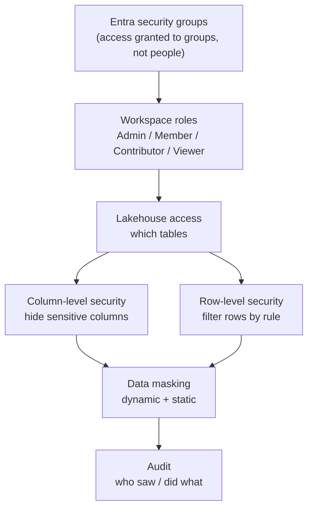

*Access narrows as you go down: from broad workspace roles to specific tables, then to individual
rows and columns, then masked values — all granted through **Entra groups** and recorded in
**audit**.*

> Because BCPC is a crown corporation, the full **Entra security model, service-principal usage,
> DEV/UAT/PROD segregation, and a who-gets-what access matrix** are set out in the
> **[Security, Access & Environment Model](#security-access--environment-model--best-practice-design)**
> deep-dive near the end of this guide.

| Item | What it means in Fabric | How we control it |
|---|---|---|
| **Define Entra Security Group Strategy** | Using Microsoft Entra ID groups (not individuals) to grant access. | **Both.** Access is granted to Entra groups; our security config references those groups so membership — not per-person edits — drives access. |
| **Define Workspace Access Model** | The workspace roles (Admin / Member / Contributor / Viewer) that set broad access. | **Standard.** A least-privilege role mapping per workspace, assigned to Entra groups and reviewed on a cadence. |
| **Define Lakehouse Access Model** | Fine-grained access to tables/columns/rows within a lakehouse. | **Platform.** Applied from config as OneLake column-level and row-level security — sensitive columns and restricted rows are enforced consistently per environment. |
| **Define Row-Level Security Standards** | Restricting which **rows** a user can see (e.g. by region or plan). | **Platform.** Row filters declared in config and applied by the framework, so the same rule ships to every environment. |
| **Define Data Masking Requirements** | Hiding or obscuring sensitive values (e.g. SIN, salary). | **Platform.** Dynamic masking at the query layer plus static masking during processing — sensitive columns can be masked, or never land in raw form at all. |
| **Define Audit Requirements** | Recording who did what, and what the pipeline did. | **Both.** Fabric's tenant audit logs for user activity, plus our run/quality/drift audit tables for the data pipeline itself. |
| **Define Compliance Requirements** | Meeting BCPC's regulatory and privacy obligations. | **Standard.** Map controls (access, masking, audit, residency) to the applicable obligations; the platform's security + audit features provide the evidence. |

### Define Fabric Architecture Standards

*The blueprint everyone builds to — layers, storage choice, and how data is brought in and shaped.*

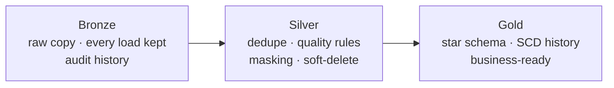

*The **medallion** in one line: raw in Bronze, cleaned and governed in Silver, business-ready in
Gold. Each item below is a rule for one part of this flow.*

| Item | What it means in Fabric | How we control it |
|---|---|---|
| **Define Bronze / Silver / Gold Architecture** | The medallion pattern: raw → cleaned/conformed → business-ready. | **Platform.** This is the spine of the control plane — Bronze (raw, append-only), Silver (deduped, quality-checked, masked), Gold (modelled star schema). |
| **Define Lakehouse vs Warehouse Guidance** | When to use a Lakehouse (files+tables, Spark) vs a Warehouse (T-SQL). | **Standard.** Default to Lakehouse for the medallion (what we've built); reach for a Warehouse only where a pure T-SQL surface is required — with the trade-offs documented. |
| **Define Ingestion Patterns** | The approved ways data comes in (batch pull, event/file drop, mirroring, gateway). | **Platform.** One connector registry covers databases, APIs, files (event-driven drop), and gateway-staged on-prem; mirroring is the managed option for near-real-time. |
| **Define Transformation Patterns** | The approved ways data is cleaned and modelled. | **Platform.** Config-driven cleanse + quality rules into Silver, and SQL-based transforms into a Gold star schema with slowly-changing-dimension history. |

---

## Milestone 2 — Data Integration Foundation

**Goal:** prove BCPC can onboard, move, transform, and manage enterprise data in Fabric.

### Implement SQL Managed Instance Integration

*Bring an Azure SQL Managed Instance in via mirroring and prove it stays fresh.*

| Item | What it means in Fabric | How we control it |
|---|---|---|
| **Validate Mirroring Configuration** | Setting up and confirming a mirrored SQL MI database in Fabric. | **Both.** Mirroring is Microsoft-managed; we validate the setup and confirm the replica lands in OneLake ready for Silver/Gold. |
| **Validate Incremental Data Synchronization** | Confirming ongoing changes flow through continuously (not just the first load). | **Both.** Mirroring streams changes automatically; we verify inserts/updates/deletes propagate and reconcile against expectations. |
| **Define Operational Procedures** | The run-book for keeping mirroring healthy (start/stop, re-seed, monitor). | **Standard.** A documented procedure for monitoring replication state, handling re-seeds, and responding to pauses. |
| **Measure Refresh Performance** | How fresh the mirrored data is (latency) and its load impact. | **Standard.** Baseline latency and resource use, with thresholds that tell us when to tune or scale. |

### Implement Oracle Integration

*Determine how BCPC's Oracle data comes in — and the trade-offs.*

| Item | What it means in Fabric | How we control it |
|---|---|---|
| **Validate Connectivity** | Confirming Fabric can reach the Oracle database (through the gateway). | **Both.** Our Oracle connector reaches the source via the gateway; a connection test confirms the path before onboarding. |
| **Assess Supplemental Logging Requirements** | Oracle change-data-capture needs supplemental logging enabled — an invasive DBA change. | **Platform.** Documented precisely in our analysis (database- and table-level logging), so BCPC's DBAs know exactly what mirroring would require. |
| **Review LogMiner Requirements** | Mirroring reads Oracle's redo logs via LogMiner, which has prerequisites and limits. | **Platform.** Captured in the analysis — LogMiner prerequisites, the broad grants required, and the read-write-source constraint. |
| **Document Limitations and Recommendations** | A clear statement of what works, what doesn't, and the recommended approach. | **Platform.** Delivered as the *Bronze vs Mirroring* recommendation: framework-based ingestion by default, mirroring selectively for near-real-time tables. |

### Establish Data Ingestion Framework

*Make ingestion standard, reusable, monitored, and resilient.*

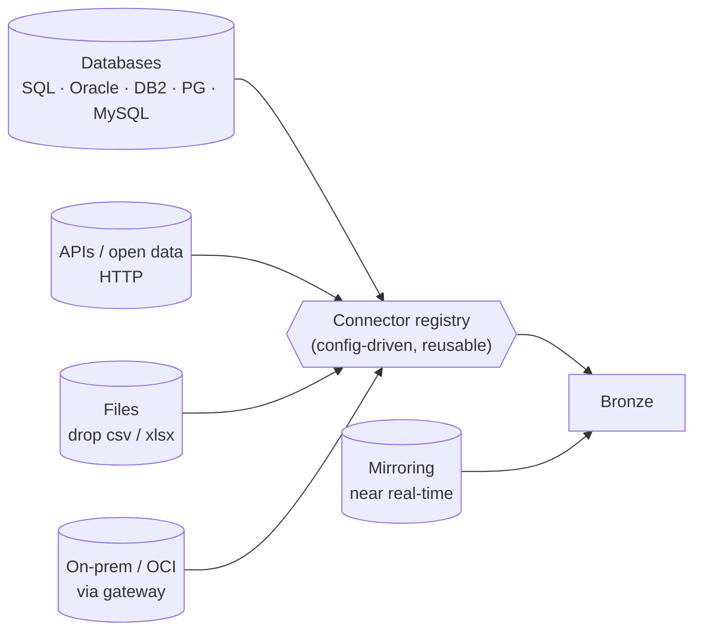

*Many source types, **one config-driven connector registry**, one landing pattern. Mirroring is the
managed option that lands straight in Bronze for near-real-time needs.*

| Item | What it means in Fabric | How we control it |
|---|---|---|
| **Define Ingestion Standards** | The consistent way every source is onboarded and lands. | **Platform.** Every source is a config entry (connection, keys, load type); the framework applies the same landing, history, and naming rules to all. |
| **Create Reusable Ingestion Templates** | Templates so a new source doesn't start from scratch. | **Platform.** Adding a source is filling in config; adding a *new kind* of source is dropping one connector file — both are templated, not bespoke. |
| **Implement Monitoring and Alerting** | Knowing when a load runs, succeeds, or fails. | **Both.** Every run is logged to audit tables with status and row counts; failures are captured for alerting, wired into the support model. |
| **Implement Error Handling Standards** | Predictable behaviour when something goes wrong. | **Platform.** Failures are isolated per source (one bad file/source doesn't stop the rest), captured with detail, and safe to re-run (idempotent). |

### Establish Data Product Standards

*Turn governed datasets into managed, published, certified products.*

*A **data product** (a governed Gold dataset) moves through a defined lifecycle with an accountable
owner at every stage.*

| Item | What it means in Fabric | How we control it |
|---|---|---|
| **Define Data Product Lifecycle** | The stages a data product moves through (draft → published → certified → retired). | **Standard.** A defined lifecycle with entry/exit criteria at each stage, owned by the data product owner. |
| **Define Publication Standards** | What "published and ready to consume" means. | **Standard.** A publication checklist — owner, documentation, quality passing, access set — before a Gold product is announced. |
| **Define Ownership Standards** | Every product has a clear, accountable owner. | **Standard.** Named owner per data product, recorded and visible, responsible for quality and consumer support. |
| **Define Certification Process** | Using Fabric endorsement to mark trusted, official products. | **Standard.** Only reviewed Gold products earn "Certified"; the process defines reviewer, criteria, and re-review cadence. |

---

## Milestone 3 — Analytics & Reporting Foundation

**Goal:** demonstrate end-to-end analytics on Fabric — from modelled data to governed reports.

### From Gold to a governed report

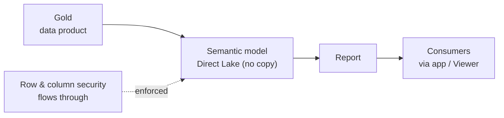

*Reports read the **Gold** model live (Direct Lake — no data copy), through a **shared semantic
model**, with **security enforced end-to-end**. The items below govern each hop.*

### Establish Semantic Model Standards

*The shared business model that reports sit on.*

| Item | What it means in Fabric | How we control it |
|---|---|---|
| **Define Semantic Model Architecture** | The reusable model (measures, relationships) between Gold data and reports — ideally Direct Lake. | **Both.** Our Gold star schema is built to be Direct-Lake-ready; the standard defines shared models over Gold rather than per-report copies. |
| **Define Naming Standards** | Consistent, business-friendly names for tables, measures, and fields. | **Standard.** A naming convention (business terms, consistent casing) so models read the same across teams. |
| **Define Reuse Standards** | Sharing one certified model instead of rebuilding per report. | **Standard.** One governed semantic model per subject area, reused by many reports; discourage private duplicates. |
| **Define Certification Standards** | Marking the trusted, official semantic models. | **Standard.** Certification criteria for models (owner, built on Gold, documented, quality-backed), aligned with the data-product process. |

### Establish Reporting Standards

*How reports are governed, published, and consumed.*

| Item | What it means in Fabric | How we control it |
|---|---|---|
| **Define Report Governance Standards** | Rules for how reports are built, reviewed, and trusted. | **Standard.** Reports build on certified semantic models, follow design/accessibility guidelines, and are reviewed before wide release. |
| **Define Publishing Standards** | Where and how reports are released to audiences. | **Standard.** Publish through governed workspaces / apps with defined audiences, versioning, and a clear promotion path. |
| **Define Workspace Consumption Standards** | How consumers access reports vs where authors build them. | **Standard.** Separate build workspaces from consumption (apps/Viewer access), so consumers get a stable, curated experience. |

### Validate Power BI Integration

*Prove the end-to-end path from Gold to a governed, secure report.*

| Item | What it means in Fabric | How we control it |
|---|---|---|
| **Validate Semantic Model Integration** | Confirming Power BI reads the Gold model efficiently (Direct Lake, no data copy). | **Both.** Gold is Direct-Lake-ready; we validate reports read it live without import refresh. |
| **Validate Security Integration** | Confirming access rules (row/column security) carry through to reports. | **Platform.** Row- and column-level security applied at the lakehouse flows through to the model and report — one rule, enforced end-to-end. |
| **Validate Workspace Strategy** | Confirming the workspace/app layout works for real authoring and consumption. | **Standard.** Validate the build-vs-consume workspace split with a real report and audience before rolling out broadly. |

---

---

## Platform Topology — Hub & Spoke

*The recommended shape for the platform: **load data once into a central hub**, and let each business
area work in its **own "spoke" workspace** that references the hub's data through **OneLake shortcuts**
— no copies. This is Microsoft's enterprise pattern for Fabric (it's how domains and OneLake are meant
to be used), and it fits BCPC well.*

### The pattern

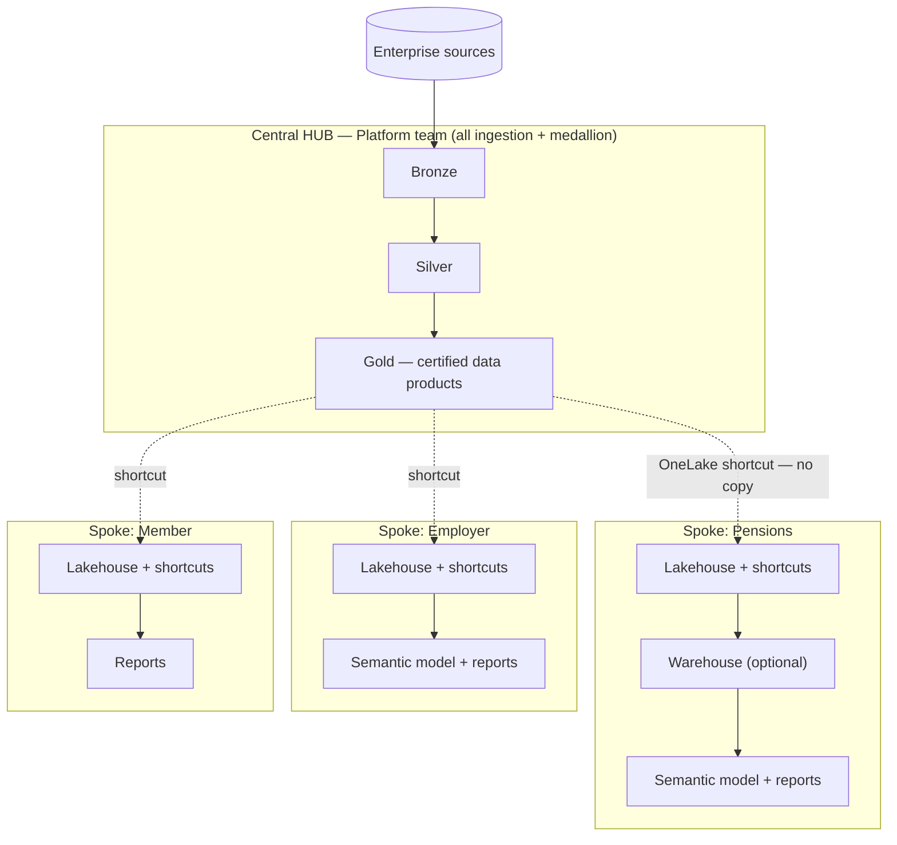

- **Hub** — a central workspace owned by the platform team. All ingestion and the medallion
  (Bronze → Silver → **Gold certified data products**) live here. There is **one physical copy** of
  the data. *This is exactly what our control plane produces.*
- **Spokes** — a workspace per business area (domain), owned by that domain's team. Each has its **own
  lakehouse** that **shortcuts** to the hub's Gold (a pointer, not a copy), plus its own **semantic
  models and reports**, and — where it needs a T-SQL surface or extra marts — its own **Warehouse**.
- **OneLake shortcuts** are references, not copies: the data stays in the hub, governed once, and every
  spoke sees the same single source of truth.

### Why this is the right design for BCPC

1. **One copy, one truth.** Data is ingested once into the hub; spokes reference it. No copies to
   reconcile, consistent numbers everywhere, lower storage.
2. **Ownership that matches the org.** The platform team owns the hub (ingestion, medallion, certified
   data); domain teams own their spokes (models, reports, marts). It makes the
   **governance operating model physical**, and maps directly onto **Fabric domains**.
3. **Self-service without a bottleneck.** Domains build freely in their own workspace, on governed and
   certified data — the platform team isn't in the path of every report.
4. **Security isolation (a crown-corp fit).** The hub is **write-locked** to the platform team; each
   spoke gets **least-privilege** access to only the products it needs; **row/column security is
   defined once at the hub** (OneLake Security) and enforced for every spoke consumer. Blast radius is
   contained per workspace / capacity.
5. **Governed consumption.** Spokes consume **certified** Gold data products, discovered through
   domains / the OneLake catalog — the endorsement model applies.
6. **Cost & capacity isolation.** Spokes run on **their own capacity**, so query cost is attributed to
   the domain that incurs it (chargeback), and a heavy spoke can't starve ingestion.
7. **Flexibility where it's needed.** A spoke needing a T-SQL surface or extra marts creates its **own
   Warehouse** over the hub shortcuts — without polluting the hub or forking the Gold.
8. **No rework for us.** Our control plane *is* the hub engine; its **Gold layer is the certified data
   products** spokes shortcut to. Hub-and-spoke is the consumption topology on top of what we've built.

### Hub vs Spoke — who owns what

| Concern | Hub (Platform team) | Spoke (Domain team) |
|---|---|---|
| **Owns** | ingestion, Bronze / Silver, certified Gold | own lakehouse, warehouse, semantic models, reports |
| **Writes data** | yes — only the platform service principal | no writes to the hub; writes only in its own workspace |
| **Consumes** | — | shortcuts to hub Gold (no copy) |
| **Security** | defines RLS / CLS / masking once (OneLake Security) | inherits hub security; sets report / item access |
| **Capacity** | platform capacity | its own capacity (chargeback) |
| **Governance** | certifies data products | consumes certified products; certifies its own reports/models |

### Design considerations to get right

*Honest trade-offs — the pattern is sound, but a few things must be designed deliberately for a
security-sensitive shop.*

| Consideration | What to do |
|---|---|
| **RLS through shortcuts** | Define row/column security at the **hub** using **OneLake Security** (storage-layer). Column security flows to consumers, and hub-side row security is enforced — but RLS propagation through cross-workspace shortcuts has **known gotchas** if done the older way, so **validate** that a spoke user sees only permitted rows/columns *before go-live* (see References). |
| **Shortcut, don't re-copy** | Standard: spokes **reference** hub Gold by shortcut and must not re-ingest or copy it — prevents drift and duplicate governance. |
| **Data-product contracts** | Hub Gold schema changes ripple to spokes; treat Gold as **versioned contracts** with change notice to consumers. |
| **Warehouses extend, not re-derive** | Spoke warehouses build marts **on top of** certified Gold; they should not re-implement the Gold transformations (avoids logic drift). |
| **Direct Lake over shortcuts** | Semantic models can use **Direct Lake** on shortcuts to Delta Gold; validate there's no unexpected DirectQuery fallback for your cases. |
| **Capacity planning** | Shortcut query compute is billed to the **consuming** spoke's capacity — good for chargeback, but size each spoke capacity for its workload. |
| **Environment model still applies** | Each of **DEV / UAT / PROD** has its own hub *and* its own spokes; the promotion and access rules in the Security section apply within each environment. |

### Promotion & CI/CD across hub and spokes

*Two things get promoted, by two owners, on **three tracks** — plus the template that stamps out the
spoke skeletons.*

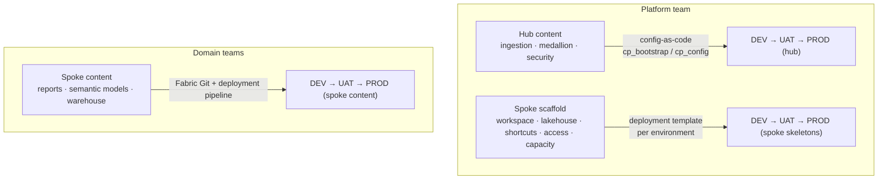

- **Hub content — platform team, config-as-code.** Our control plane already promotes the whole
  medallion (ingestion, DQ, gold, security) **identically** DEV → UAT → PROD via GitHub Actions →
  `cp_bootstrap` / `cp_config`. The deploy service principal is the only identity that changes PROD.
- **Spoke scaffold — platform team, deployment template.** The same template provisions each
  predefined spoke workspace **per environment**: the workspace, its lakehouse, its **shortcuts to
  that environment's hub Gold**, Entra role assignments, and capacity. One command, all environments.
- **Spoke content — domain teams, Fabric CI/CD.** Each domain owns its reports, semantic models, and
  any warehouse logic, and promotes them DEV-spoke → UAT-spoke → PROD-spoke using **Git integration +
  Fabric deployment pipelines** ([deployment pipelines](https://learn.microsoft.com/en-us/fabric/cicd/deployment-pipelines/intro-to-deployment-pipelines) · [Git](https://learn.microsoft.com/en-us/fabric/cicd/git-integration/intro-to-git-integration)), with
  deployment rules for any per-env bits.

**The critical shortcut rule.** Shortcuts are **provisioned per environment by the template** and point
at the **env-local hub** — they are *not* promoted as content. This guarantees a UAT spoke can only
ever reference UAT data, never PROD. (Promote code/config — never data, never cross-env pointers.)

> **Validated in our tenant (DEV → UAT).** We created a feature spoke in DEV — a lakehouse with
> OneLake shortcuts to the hub's Gold — paired it to a UAT spoke in a Fabric **deployment pipeline**,
> and deployed. The pipeline **successfully promoted** the lakehouse *and* its shortcuts to UAT — but
> the promoted shortcuts **still pointed at the DEV hub**. That is exactly the cross-environment leak
> this rule prevents. The fix: **provision shortcuts per environment** (template, pointing at the
> env-local hub) or add a **deployment rule** to rebind the source — never promote shortcuts blindly.

| Spoke element | Provisioned by platform template (per env) | Promoted by domain (Fabric CI/CD) |
|---|---|---|
| Workspace | yes | — |
| Lakehouse | yes | — |
| Shortcuts to hub Gold | yes — **env-local, never cross-env** | — |
| Entra role assignments | yes | — |
| Capacity assignment | yes | — |
| Semantic models | — | yes |
| Reports | — | yes |
| Warehouse (custom logic) | optional empty scaffold | yes (the logic) |

**Should we stand up spokes in the lower environments?** Yes:

- **At minimum UAT + PROD**, so business users validate in UAT (on masked / representative data) before
  anything reaches PROD — this is the UAT sign-off in the access matrix.
- **Full DEV + UAT + PROD** for any domain that actually *builds* content (custom models, warehouses) —
  they need a DEV spoke to develop and a promotion path.
- A **pure-consumer** domain (reports only, on certified Gold) can start with UAT + PROD and add DEV later.
- Lower-env spokes shortcut to the **lower-env hub**, so testing uses safe (masked/synthetic) data —
  consistent with the privacy model.

**Is it easy to add spokes to the deployment template?** Yes — a natural extension of the template we
already have, not new infrastructure:

- Add a **`feature_workspaces`** (spokes) list to the manifest: name, domain, the hub Gold tables to
  shortcut, and the Entra groups + capacity to assign.
- `cp_bootstrap` loops the list and, per spoke, creates the workspace, its lakehouse, the shortcuts
  (env-local hub), the role assignments, and the capacity binding — the **same REST patterns we already
  use for the hub**, plus a shortcut-creation helper ([OneLake shortcuts](https://learn.microsoft.com/en-us/fabric/onelake/onelake-shortcuts)).
- **Idempotent** and per-environment: `deploy DEV|UAT|PROD` brings up the hub **and** its full set of
  spokes in one command.
- New spokes are added through the workspace-creation process (a config entry), keeping the set
  governed and consistent.

> *This spoke-provisioning is a recommended enhancement to the current template — which today
> provisions the hub. The workspace / lakehouse / role-assignment APIs are already in use, so it is
> incremental work, not a rebuild.*

> **How it maps to the milestones.** This topology realizes Milestone 1's *Define Workspace Structure*,
> *Domain Alignment Strategy*, *Lakehouse Organization Standards*, and *Data Sharing Standards*; the
> Milestone 3 semantic models and reports are what live in the spokes.

### References

- OneLake shortcuts — [overview](https://learn.microsoft.com/en-us/fabric/onelake/onelake-shortcuts) · [secure & manage shortcuts](https://learn.microsoft.com/en-us/fabric/onelake/onelake-shortcut-security)
- OneLake Security — [access-control model](https://learn.microsoft.com/en-us/fabric/onelake/security/data-access-control-model) · [with shortcuts (RLS/CLS behavior)](https://blog.fabric.microsoft.com/en-us/blog/understanding-onelake-security-with-shortcuts/)
- Fabric domains (data mesh) — [domains](https://learn.microsoft.com/en-us/fabric/governance/domains)
- CI/CD — [deployment pipelines](https://learn.microsoft.com/en-us/fabric/cicd/deployment-pipelines/intro-to-deployment-pipelines) · [Git integration](https://learn.microsoft.com/en-us/fabric/cicd/git-integration/intro-to-git-integration)

---

## Security, Access & Environment Model — best-practice design

*BCPC is a government crown corporation: access control, data privacy, and environment isolation are
first-order requirements, not afterthoughts. This section expands the Security and Governance items
above into a concrete, best-practice design. It is a recommendation to adopt and refine with BCPC's
security team — the platform already provides the enforcement mechanisms it relies on.*

**Guiding principles**

- **Group-based, never individual.** All access is granted to Microsoft Entra ID security groups; you
  change *membership*, never per-person permissions.
- **Least privilege + just-in-time.** People get the minimum role; privileged and production access is
  granted on demand through **PIM** (Privileged Identity Management) with approval — not standing.
- **People and machines don't mix.** Humans never authenticate as service principals; automation never
  runs as a personal account.
- **Production data stays in production.** Lower environments use masked, synthetic, or subset data.
- **Change production only by promotion.** No manual edits in PROD — changes flow through the
  deployment pipeline, executed by a service principal.
- **Everything is auditable.** Access grants, data reads, and pipeline actions are all logged.

### Entra ID security model

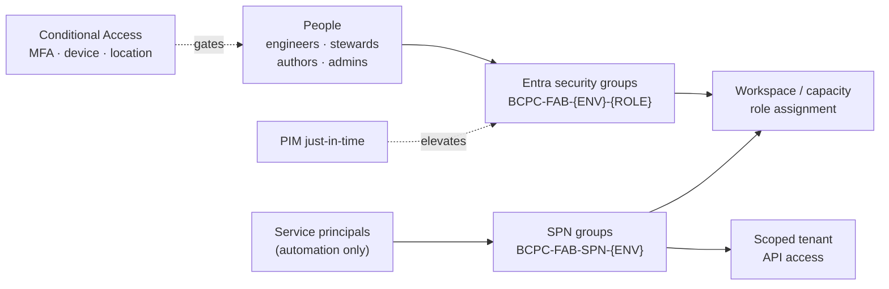

Access is assigned to **groups**, and the groups are assigned to workspaces and capacities. Adding or
removing a person is a membership change — the permission model never changes.

| Group (naming convention) | Members | Purpose |
|---|---|---|
| `BCPC-FAB-{ENV}-Engineers` | Data engineers | Build access in that environment's workspaces |
| `BCPC-FAB-{ENV}-ReportAuthors` | Analysts | Author semantic models / reports in that environment |
| `BCPC-FAB-{ENV}-Consumers` | Business users | View published reports (via app) |
| `BCPC-DATA-{DOMAIN}-Stewards` | Data stewards | Governance for a data domain (Pensions, Employer, Member) |
| `BCPC-FAB-Platform-Admins` | Platform team | Tenant / capacity administration — **PIM-enabled** |
| `BCPC-FAB-Auditors` | Security / audit | Read + audit-log access across environments |
| `BCPC-FAB-SPN-{ENV}` | Service principals | Container for automation identities; scopes tenant API access |

*Supporting controls:* **Conditional Access** (MFA + compliant device + allowed location) on all Fabric
access; **PIM** for admin and production roles; **quarterly access reviews**; and separately-held
**break-glass** admin accounts excluded from Conditional Access for emergencies only.

### Fabric access control — defense in depth

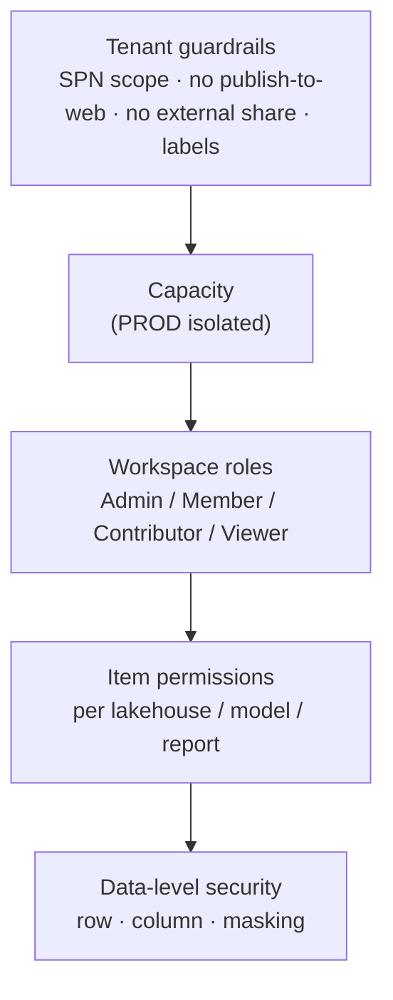

Access is controlled at **five layers**, each narrower than the last. A consumer, for example, passes
tenant policy, sits on the capacity, gets **Viewer** on one workspace, sees only the published report
item, and even then only the **rows and columns** their data-level security allows.

### Service principals (SPNs) and managed identities

Automation — deployment, scheduled runs, and source connections — uses **service principals** (or
managed identities where Fabric supports them), never personal accounts. Best practice:

- **One SPN per environment**, so a lower-environment credential can never touch production.
- **Least privilege** — grant the SPN only the workspace role it needs, not tenant admin.
- **Secrets/certificates in Key Vault** (certificate auth preferred over secrets), **rotated** on a
  schedule, **never in git**.
- Enable the tenant setting *"service principals can use Fabric APIs"* **only for the `BCPC-FAB-SPN-*`
  group**, not the whole organization.

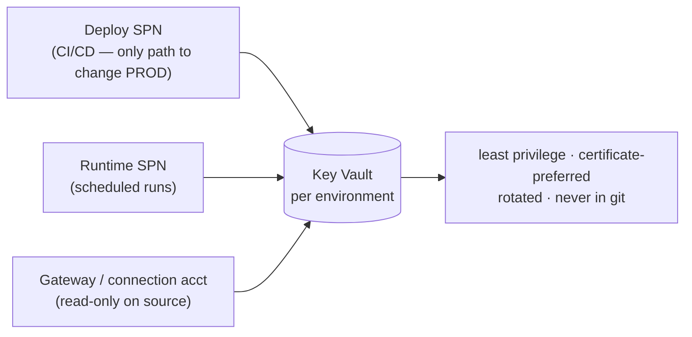

| Identity (per environment) | Used for | Access | Credential |
|---|---|---|---|
| **Deployment SPN** | CI/CD — provision + promote code/config | Member on that env's workspaces; **the only identity that changes PROD** | Cert in that env's Key Vault |
| **Runtime SPN** | Scheduled pipeline / notebook execution | Contributor on that env's workspaces | env Key Vault |
| **Gateway / connection account** | Source connectivity via the gateway | **Read-only** on the source database (least privilege) | env Key Vault |
| **Managed identity** *(preferred where supported)* | Fabric-to-Azure resource access | Scoped to the specific resource | none to manage |

*Our control plane already follows this:* it authenticates as a service principal, reads connection
secrets from Key Vault at run time, and keeps no secrets (or host names) in git.

### Environment segregation — lower vs production

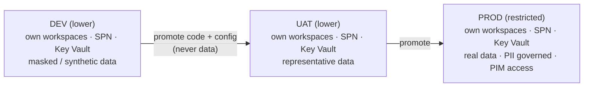

Every environment is a hard boundary with its **own** workspaces, service principals, Key Vault, and
source connections. **Production data never flows downward** — lower environments run on masked or
synthetic data. Promotion moves **code and configuration only**, through the deployment pipeline.

| Isolated per environment | DEV | UAT | PROD |
|---|---|---|---|
| Workspaces | separate | separate | separate |
| Capacity | shared acceptable | shared acceptable | **dedicated (recommended)** |
| Entra groups | own | own | own |
| Service principals | own | own | own |
| Key Vault (secrets) | own | own | own — **prod credentials live only here** |
| Source connection | DEV source | UAT source | PROD source |
| Data | masked / synthetic | masked / representative | real (PII governed) |
| Human change access | build freely | limited | **none standing — promotion only** |

### Who gets what — access matrix

*The core of an access-control review: which persona gets which level in which environment. Adjust with
BCPC's security team, but the shape — broad in DEV, tight in PROD, promotion-only for changes — should hold.*

| Persona / identity | DEV | UAT | PROD |
|---|---|---|---|
| **Platform / Fabric Admin** | Admin (PIM) | Admin (PIM) | Admin — **PIM just-in-time + approval**; break-glass held separately |
| **Data Engineer / Developer** | Contributor / Member (build) | Viewer, or Contributor for fixes | **No standing access** — changes via pipeline only |
| **Data Steward** | Member (governance) | Member | Viewer + governance tooling (no data edits) |
| **Report Author / Analyst** | Contributor (reporting workspace) | Contributor (validate) | Author only in a dedicated authoring workspace; **Viewer** on curated data |
| **Business Consumer** | — | Viewer (UAT sign-off) | **Viewer via published app** only |
| **Auditor / Security** | Viewer + audit logs | Viewer + audit logs | Viewer + audit logs |
| **Deployment SPN** (CI/CD) | Member (deploy) | Member (deploy) | Member (deploy) — **only path to change PROD** |
| **Runtime SPN** (scheduled) | Contributor (run) | Contributor (run) | Contributor (run) |
| **Gateway / connection account** | read-only on DEV source | read-only on UAT source | read-only on PROD source |

### Data security & privacy

| Control | Best practice |
|---|---|
| **PII minimization** | Mask or exclude sensitive columns **at ingest** (Silver) — sensitive data need never land raw in OneLake. *(Platform.)* |
| **Row / column security** | OneLake row- and column-level security applied from config, consistently per environment. *(Platform.)* |
| **Masking** | Dynamic masking at query time + static masking during processing. *(Platform.)* |
| **Sensitivity labels** | Apply Microsoft Purview Information Protection labels (e.g. *Confidential – PII*) to items; labels travel with the data. |
| **Data residency** | Host the Fabric capacity in a **Canadian region** (Canada Central / Canada East); confirm no cross-geo processing for a crown corporation. |
| **Encryption** | Encrypted at rest by default; evaluate **customer-managed keys** if BCPC policy requires. |
| **DLP / export** | Microsoft Purview DLP policies for Fabric; **disable publish-to-web** and restrict export/download on sensitive workspaces. |
| **No PII downstream** | Lower environments and shared datasets carry masked/synthetic data only. |

### Data connections & network controls

| Control | Best practice |
|---|---|
| **Connectivity path** | Private only — through the data gateway or private endpoints; **no public internet path** to sources. |
| **Connection credentials** | Least-privilege, **read-only** source accounts; credentials in Key Vault, never in config or git. |
| **Who can create connections** | Restrict connection creation to platform admins / a defined group; **share** governed connections rather than scattering credentials. |
| **Connection reuse** | One governed connection per source per environment, reused — not per-user copies. |
| **Gateway** | Dedicated gateway VM(s); kept patched; clustered for HA if used for continuous mirroring. |
| **Access gating** | Conditional Access (MFA + compliant device + allowed location) on all Fabric / Power BI access. |

### Tenant-level guardrails (admin checklist)

| Tenant setting | Recommended for BCPC |
|---|---|
| Service principals can use Fabric APIs | **Enabled only for the `BCPC-FAB-SPN-*` group**, not org-wide |
| Publish to web | **Disabled** |
| External / guest sharing | **Disabled** (or tightly restricted with approval) |
| Export & download (Excel / CSV / …) | **Restricted** for sensitive workspaces |
| Sensitivity labels | **Enabled and enforced**; mandatory labelling on new items |
| Audit logging | **Enabled**; logs shipped to BCPC's SIEM |
| Workspace creation | **Restricted** to the platform team / request process |
| Capacity assignment | **Restricted** — control which workspaces run on which capacity |
| Conditional Access | **Enforced** on the Fabric / Power BI service |

---

*Companion documents:* the **Bronze vs Mirroring** analysis (Oracle/SQL-MI ingestion trade-offs and
recommendation), the **private-OCI architecture diagrams** (framework and mirroring paths), and the
control-plane **engine + working guides** in the repository.
