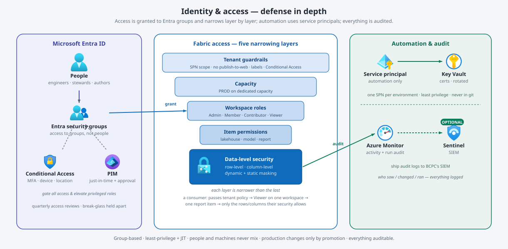
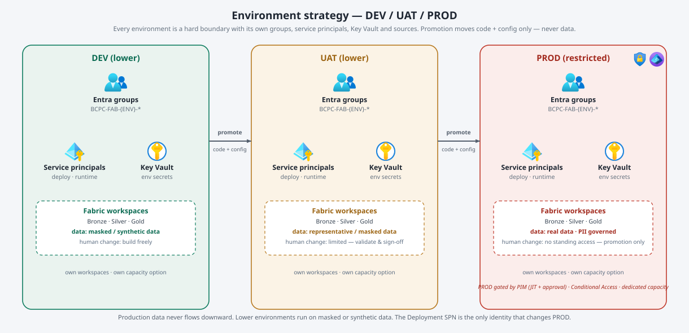
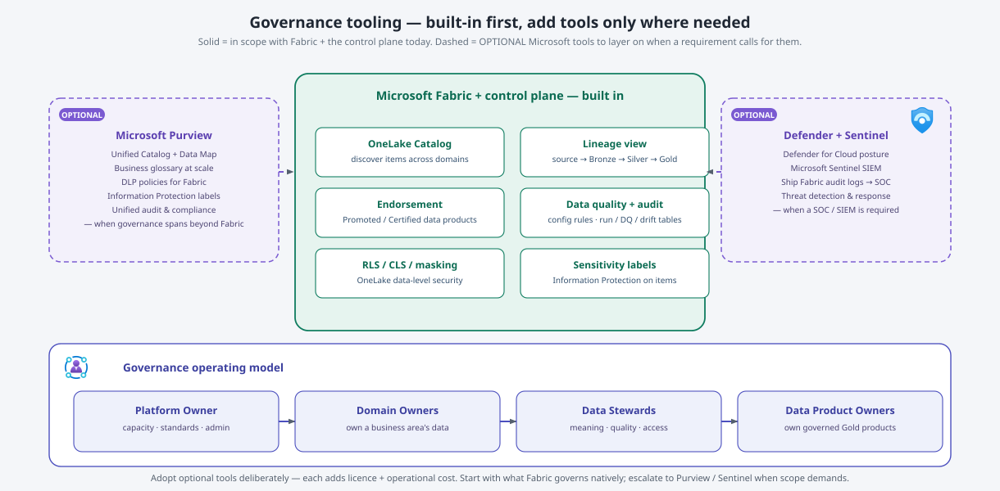

# Fabric Governance, Security & Environment Strategy — BC Pension Corporation

**Purpose.** A single, standalone plan for **how the Fabric platform is governed, secured, and split across
environments** for BC Pension Corporation (BCPC). BCPC is a government **crown corporation**: access
control, data privacy, and environment isolation are first-order requirements, not afterthoughts. This
document consolidates and expands the governance/security material from the *Fabric Delivery Guide* into a
design that can be reviewed and adopted with BCPC's security team — the platform already provides the
enforcement mechanisms it relies on.

**Verification date:** 2026-07-28. Diagrams use the **official Microsoft Azure architecture icons**
(Entra ID, Conditional Access, PIM, Managed Identities, Key Vault, Information Protection, Azure Monitor,
Sentinel). Tools not shipped as an Azure service icon (Microsoft Fabric, Purview) are drawn as labelled
elements. Everything marked **OPTIONAL** is a tool to add only when a requirement calls for it.

**Companion documents:** *Fabric ingestion decision guide* (Bronze vs Mirroring), *Fabric gateway decision
guide* (VNet vs on-prem gateway), and the *Fabric Delivery Guide* (milestones). This doc is the
governance/security/environment spine those reference.

---

## 0. Guiding principles

- **Group-based, never individual.** All access is granted to Microsoft Entra ID security groups; you
  change *membership*, never per-person permissions.
- **Least privilege + just-in-time.** People get the minimum role; privileged and production access is
  granted on demand through **PIM** (Privileged Identity Management) with approval — not standing.
- **People and machines don't mix.** Humans never authenticate as service principals; automation never
  runs as a personal account.
- **Production data stays in production.** Lower environments use masked, synthetic, or subset data.
- **Change production only by promotion.** No manual edits in PROD — changes flow through the deployment
  pipeline, executed by a service principal.
- **Private by default.** No public-internet path to sources; connectivity is via gateway / private
  endpoint (see the gateway guide).
- **Everything is auditable.** Access grants, data reads, and pipeline actions are all logged.
- **Built-in first.** Govern with what Fabric + the control plane provide; add Purview / Sentinel only
  where scope genuinely demands (see §7).

---

## 1. Governance operating model — who runs the platform

*Who owns the platform and the data, and by what process.*

| Role | Owns | Key responsibilities |
|---|---|---|
| **Platform Owner** (small central team) | The Fabric platform / capacity — the "landlord" | Capacity, tenant/admin settings, the standards in this guide, release management. |
| **Capacity Admin** | Capacity sizing & guardrails | Monitor via the Capacity Metrics app; throttling/surge guardrails; scale/rebalance path. |
| **Platform Admins** | Tenant, gateways, releases | Tenant settings, gateway upkeep, deployment pipelines, incident response (RACI). |
| **Domain Owners** (per business area) | Their area's data | Accountable for the data in their domain (Pensions, Employer, Member). |
| **Data Stewards** (per domain) | Meaning, quality, access | Definitions, quality rules, and access decisions for their data. |
| **Data Product Owners** | Governed Gold products | Each Gold output has an owner, documented purpose, and a consumer contract. |

**Supporting processes (standards):** a **workspace request → approve → provision** flow (every workspace
created to standard, not ad hoc); **onboarding checklist** ending in config-as-code entries; **capacity
governance** (monitor, allocate, protect); **endorsement/certification** — reserve *Certified* for governed
Gold data products, with defined owners and criteria.

---

## 2. Data governance framework — who owns the data

| Area | What it means in Fabric | How we control it |
|---|---|---|
| **Domain ownership** | Which business area owns which data. | Data domains map to business areas with a named domain owner. |
| **Stewardship** | Curating meaning, quality, access. | A steward per domain owns definitions, quality rules, and access decisions. |
| **Data products** | Governed datasets as "products". | Gold outputs are the products — each has an owner, purpose, and consumer contract. |
| **Metadata** | What data exists, its schema and meaning. | Platform captures technical metadata (sources, schemas, drift, run history) in config + audit tables; OneLake catalog + a business glossary add business meaning. |
| **Data quality** | Rules deciding if data is fit to use. | Declarative rules (not-null, ranges, allowed values, expressions) run into Silver; failing rows quarantined off the clean layer. |
| **Lineage** | Trace where data came from and what it feeds. | Fabric's built-in lineage view + our audit tables recording every source→bronze→silver→gold run. |
| **Lifecycle** | Retention, history, archival. | Bronze append-only history (audit trail); Silver/Gold hold current + SCD history; a retention standard per layer. |
| **Sharing** | Share across teams without copying. | Prefer OneLake shortcuts / sharing over copies — one trusted copy, governed by access + certification. |

---

## 3. Security framework — who can see what

*Access is granted to **Entra groups**, gated by **Conditional Access** and **PIM**, and then narrows layer
by layer inside Fabric — from tenant guardrails down to the individual **rows, columns, and masked values**.
Automation runs as **service principals** with secrets in **Key Vault**, and every action is **audited**.*

### 3.1 Entra ID security model

Access is assigned to **groups**, and groups are assigned to workspaces and capacities. Adding or removing a
person is a membership change — the permission model never changes.

| Group (naming convention) | Members | Purpose |
|---|---|---|
| `BCPC-FAB-{ENV}-Engineers` | Data engineers | Build access in that environment's workspaces |
| `BCPC-FAB-{ENV}-ReportAuthors` | Analysts | Author semantic models / reports in that environment |
| `BCPC-FAB-{ENV}-Consumers` | Business users | View published reports (via app) |
| `BCPC-DATA-{DOMAIN}-Stewards` | Data stewards | Governance for a data domain (Pensions, Employer, Member) |
| `BCPC-FAB-Platform-Admins` | Platform team | Tenant / capacity administration — **PIM-enabled** |
| `BCPC-FAB-Auditors` | Security / audit | Read + audit-log access across environments |
| `BCPC-FAB-SPN-{ENV}` | Service principals | Container for automation identities; scopes tenant API access |

*Supporting controls:* **Conditional Access** (MFA + compliant device + allowed location) on all Fabric
access; **PIM** for admin and production roles; **quarterly access reviews**; and separately-held
**break-glass** admin accounts excluded from Conditional Access for emergencies only.

### 3.2 Defense in depth — five narrowing layers

Access is controlled at **five layers**, each narrower than the last (see the diagram above). A consumer,
for example, passes tenant policy, sits on the capacity, gets **Viewer** on one workspace, sees only the
published report item, and even then only the **rows and columns** their data-level security allows.

| Layer | Control |
|---|---|
| **Tenant guardrails** | SPN scope, publish-to-web off, external-share off, mandatory labels, Conditional Access. |
| **Capacity** | PROD on **dedicated** capacity; controlled workspace→capacity assignment. |
| **Workspace roles** | Least-privilege Admin / Member / Contributor / Viewer, assigned to Entra groups, reviewed on cadence. |
| **Item permissions** | Per lakehouse / semantic model / report. |
| **Data-level security** | OneLake **row-level** and **column-level** security + **dynamic + static masking**, applied from config per environment. |

### 3.3 Service principals & managed identities

Automation — deployment, scheduled runs, and source connections — uses **service principals** (or managed
identities where Fabric supports them), never personal accounts.

| Identity (per environment) | Used for | Access | Credential |
|---|---|---|---|
| **Deployment SPN** | CI/CD — provision + promote code/config | Member on that env's workspaces; **the only identity that changes PROD** | Cert in that env's Key Vault |
| **Runtime SPN** | Scheduled pipeline / notebook execution | Contributor on that env's workspaces | env Key Vault |
| **Gateway / connection account** | Source connectivity via the gateway | **Read-only** on the source (least privilege) | env Key Vault |
| **Managed identity** *(preferred where supported)* | Fabric-to-Azure resource access | Scoped to the specific resource | none to manage |

Best practice: **one SPN per environment** (a lower-env credential can never touch PROD); least privilege
(not tenant admin); **certificate auth preferred**, rotated on schedule, **never in git**; enable the
tenant setting *"service principals can use Fabric APIs"* **only for `BCPC-FAB-SPN-*`**. *Our control plane
already follows this — it authenticates as an SPN, reads connection secrets from Key Vault at run time, and
keeps no secrets (or host names) in git.*

### 3.4 Data security & privacy

| Control | Best practice |
|---|---|
| **PII minimization** | Mask or exclude sensitive columns **at ingest** (Silver) — sensitive data need never land raw in OneLake. *(Platform.)* |
| **Row / column security** | OneLake row- and column-level security applied from config, consistently per environment. *(Platform.)* |
| **Masking** | Dynamic masking at query time + static masking during processing. *(Platform.)* |
| **Sensitivity labels** | Microsoft Purview **Information Protection** labels (e.g. *Confidential – PII*) on items; labels travel with the data. |
| **Data residency** | Host the Fabric capacity in a **Canadian region** (Canada Central / East); confirm no cross-geo processing. |
| **Encryption** | Encrypted at rest by default; evaluate **customer-managed keys** if BCPC policy requires. |
| **DLP / export** | Purview DLP policies for Fabric; **disable publish-to-web**; restrict export/download on sensitive workspaces. |
| **No PII downstream** | Lower environments and shared datasets carry masked/synthetic data only. |

---

## 4. Environment strategy — DEV / UAT / PROD

Every environment is a **hard boundary** with its **own** workspaces, service principals, Key Vault, and
source connections. **Production data never flows downward** — lower environments run on masked or synthetic
data. Promotion moves **code and configuration only**, through the deployment pipeline, executed by the
Deployment SPN.

### 4.1 Isolation matrix

| Isolated per environment | DEV | UAT | PROD |
|---|---|---|---|
| Workspaces | separate | separate | separate |
| Capacity | shared acceptable | shared acceptable | **dedicated (recommended)** |
| Entra groups | own | own | own |
| Service principals | own | own | own |
| Key Vault (secrets) | own | own | own — **prod credentials live only here** |
| Source connection | DEV source | UAT source | PROD source |
| Data | masked / synthetic | masked / representative | real (PII governed) |
| Human change access | build freely | limited | **none standing — promotion only** |

### 4.2 Who gets what — access matrix

*The core of an access-control review: which persona gets which level in which environment. The shape —
broad in DEV, tight in PROD, promotion-only for changes — should hold.*

| Persona / identity | DEV | UAT | PROD |
|---|---|---|---|
| **Platform / Fabric Admin** | Admin (PIM) | Admin (PIM) | Admin — **PIM JIT + approval**; break-glass held separately |
| **Data Engineer / Developer** | Contributor / Member (build) | Viewer, or Contributor for fixes | **No standing access** — changes via pipeline only |
| **Data Steward** | Member (governance) | Member | Viewer + governance tooling (no data edits) |
| **Report Author / Analyst** | Contributor (reporting workspace) | Contributor (validate) | Author only in a dedicated authoring workspace; **Viewer** on curated data |
| **Business Consumer** | — | Viewer (UAT sign-off) | **Viewer via published app** only |
| **Auditor / Security** | Viewer + audit logs | Viewer + audit logs | Viewer + audit logs |
| **Deployment SPN** (CI/CD) | Member (deploy) | Member (deploy) | Member (deploy) — **only path to change PROD** |
| **Runtime SPN** (scheduled) | Contributor (run) | Contributor (run) | Contributor (run) |
| **Gateway / connection account** | read-only on DEV source | read-only on UAT source | read-only on PROD source |

### 4.3 Promotion & CI/CD

Changes flow **DEV → UAT → PROD** through Fabric deployment pipelines (or Git + the control-plane deploy
scripts), executed by the **Deployment SPN**. Only **code + config** promote — never data, never connection
secrets (those are per-environment in Key Vault). Feature workspaces in lower environments let business
users validate before promotion. *(Details in the CI/CD guide and the hub-and-spoke section of the Delivery
Guide.)*

---

## 5. Network & connectivity controls

| Control | Best practice |
|---|---|
| **Connectivity path** | Private only — through the data gateway or private endpoints; **no public internet path** to sources. |
| **Connection credentials** | Least-privilege, **read-only** source accounts; credentials in Key Vault, never in config or git. |
| **Who can create connections** | Restrict to platform admins / a defined group; **share** governed connections rather than scattering credentials. |
| **Gateway** | Dedicated gateway VM(s); patched; HA-clustered for continuous mirroring. **Which gateway** (VNet vs on-prem) is decided in the *gateway decision guide*. |
| **Access gating** | Conditional Access (MFA + compliant device + allowed location) on all Fabric / Power BI access. |

*See the **Fabric gateway decision guide** for the full VNet-vs-on-prem gateway design (incl. which
mirroring sources require which gateway).*

---

## 6. Tenant-level guardrails (admin checklist)

| Tenant setting | Recommended for BCPC |
|---|---|
| Service principals can use Fabric APIs | **Enabled only for the `BCPC-FAB-SPN-*` group**, not org-wide |
| Publish to web | **Disabled** |
| External / guest sharing | **Disabled** (or tightly restricted with approval) |
| Export & download (Excel / CSV / …) | **Restricted** for sensitive workspaces |
| Sensitivity labels | **Enabled and enforced**; mandatory labelling on new items |
| Audit logging | **Enabled**; logs shipped to BCPC's SIEM |
| Workspace creation | **Restricted** to the platform team / request process |
| Capacity assignment | **Restricted** — control which workspaces run on which capacity |
| Conditional Access | **Enforced** on the Fabric / Power BI service |

---

## 7. Optional tooling — add only where needed

**Start with what Fabric + the control plane already govern** (catalog, lineage, endorsement, data quality
+ audit, RLS/CLS/masking, sensitivity labels). Layer on the tools below **only when a specific requirement
calls for them** — each adds licence and operational cost.

| Optional tool | What it adds beyond built-in | Adopt when… |
|---|---|---|
| **Microsoft Purview** *(optional)* | Enterprise **Unified Catalog + Data Map**, business glossary at scale, **DLP policies for Fabric**, **Information Protection** labels, unified audit/compliance across estates. | Governance / classification must span **beyond Fabric** (on-prem, other clouds, M365), or a formal DLP + compliance program is required. |
| **Microsoft Sentinel** *(optional)* | **SIEM** — ingest Fabric/Entra audit logs, correlation, threat detection & response, SOC workflows. | A **SOC / SIEM** is mandated and audit logs must feed centralized detection. |
| **Microsoft Defender for Cloud** *(optional)* | Cloud security posture management + workload protection for the surrounding Azure resources. | Broader Azure posture management is in scope. |
| **Customer-managed keys (CMK)** *(optional)* | Bring-your-own encryption keys for OneLake/capacity. | BCPC policy requires key custody beyond Microsoft-managed encryption. |

*Recommendation for BCPC:* run on **built-in governance** first; treat **Purview** as the most likely
near-term addition (crown-corporation classification/DLP), and **Sentinel** as the audit-log SIEM sink if a
SOC is in scope. Neither is required for the platform to be secure and governed at launch.

---

## 8. References (official Microsoft, verified 2026-07-28)

- Microsoft Entra ID security groups: https://learn.microsoft.com/en-us/entra/fundamentals/concept-learn-about-groups
- Conditional Access: https://learn.microsoft.com/en-us/entra/identity/conditional-access/overview
- Privileged Identity Management (PIM): https://learn.microsoft.com/en-us/entra/id-governance/privileged-identity-management/pim-configure
- Fabric security overview: https://learn.microsoft.com/en-us/fabric/security/security-overview
- OneLake security (RLS/CLS): https://learn.microsoft.com/en-us/fabric/onelake/security/get-started-security
- Fabric service principals: https://learn.microsoft.com/en-us/fabric/admin/service-principal
- Fabric deployment pipelines: https://learn.microsoft.com/en-us/fabric/cicd/deployment-pipelines/intro-to-deployment-pipelines
- Fabric sensitivity labels (Information Protection): https://learn.microsoft.com/en-us/fabric/governance/information-protection
- Microsoft Purview for Fabric: https://learn.microsoft.com/en-us/purview/microsoft-fabric
- Microsoft Sentinel: https://learn.microsoft.com/en-us/azure/sentinel/overview
- Azure architecture icons (used in the diagrams): https://learn.microsoft.com/en-us/azure/architecture/icons/
